layout: true

<div class="my-footer">
  <span style="text-align:center">
    <span> 
      
    </span>
    <a href="https://therbootcamp.github.io/">
      <span style="padding-left:82px"> 
        <font color="#7E7E7E">
          www.therbootcamp.com
        </font>
      </span>
    </a>
    <a href="https://therbootcamp.github.io/">
      <font color="#7E7E7E">
       Statistik mit R | Mai 2020
      </font>
    </a>
    </span>
  </div> 

---

```{r, eval = TRUE, echo = FALSE, warning=F,message=F}
# Code to knit slides

```

```{r setup, include=FALSE}
options(htmltools.dir.version = FALSE)

options(width = 110)
options(digits = 4)

# Load packages
require(tidyverse)
library(cowplot)
library(ggpubr)

knitr::opts_chunk$set(fig.align = "center", warning = FALSE, message = FALSE, dpi = 300)


# Load data
baselers <- readr::read_csv("1_Data/baselers.csv")

# get color palette functions
source("../../_materials/palette/therbootcamp_palettes.R")
colors = baselrbootcamp_colors

```


# Was ist Statistik?


.pull-left45[


<i>"Lehre von den Daten über den Staat“</i><br><font style="font-size:10px"><a href="https://de.wikipedia.org/wiki/Statistik">Gottfried Achenwall, 1749</a></font>

<i>"...eine umfangreiche Beschreibung der gesellschaftlichen, politischen und wirtschaftlichen Eigenschaften eines Staates"</i><br><font style="font-size:10px"><a href="https://de.wikipedia.org/wiki/Statistik">Ernst Landberg über den Statistikbegriff von Achenwall</a></font>

Von <i>statisticum</i>, lat., den Staat betreffend.<br><font style="font-size:10px"><a href="https://de.wikipedia.org/wiki/Statistik">Wikipedia</a></font>


]

.pull-right45[


<p align = "center">
  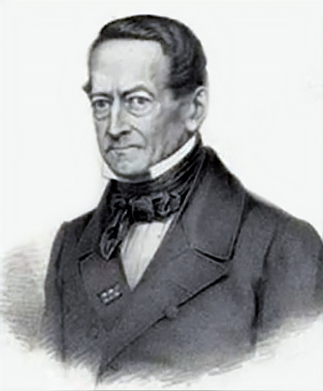<br>
  Gottfried Achenwall, 1719 - 1772<br>
  <font style="font-size:10px">from <a href="https://www.pinterest.de/biografiaspuntoinfo/">pinterest.de</a></font>
</p>


]

---

# Äste der Statistik

.pull-left45[

### Deskriptive Statistik


<ul>
  <li class="m1"><span><high>Zusammenfassung</high> zentraler Eigenschaften der Daten durch etablierte Masse</span></li>
  <li class="m2"><span><high>Eigenschaften</high> und <high>Masse</high></span></li>
  <ul class=level>
    <li><span><b>Häufigkeiten</b></span></li>
    <li><span><b>Zentralität</b>: Mittelwert, Median, Modalwert</span></li>
    <li><span><b>Streuung</b>: Varianz, Interquartilabstand, Spannweite</span></li>
    <li><span><b>Zusammenhänge</b>: Diverse Korrelationsmasse</span></li>
  </ul>
  <li class="m3"><span><high>Visualisierung</high></span></li>
</ul>

]


.pull-right45[

### Inferenzstatistik

<ul>
  <li class="m1"><span><high>Entscheidungen</high> über deskriptive Statistiken</span></li>
  <ul class=level>
    <li><span><high>Unterscheidet</high> sich ein deskriptives Mass <high>von angenommenen Werten</high>, z.B. 0.</span></li>
    <li><span>Unterscheiden sich <high>deskriptive Masse untereinander</high></span></li>
  </ul>
  <li class="m2"><span><high>Schätzungen</high> über deskriptive Statistiken</span></li>
</ul>

]

---


# Deskriptive Statistik

.pull-left45[

<ul>
  <li class="m1"><span><high>Zusammenfassung</high> zentraler Eigenschaften der Daten durch etablierte Masse</span></li>
  <li class="m2"><span><high>Masse</high></span></li>
  <ul class=level>
    <li><span><b>Häufigkeiten</b></span></li>
    <li><span><b>Zentralität</b>: Mittelwert, Median, Modalwert</span></li>
    <li><span><b>Streuung</b>: Varianz, Interquartilabstand, Spannweite</span></li>
    <li><span><b>Zusammenhänge</b>: Diverse Korrelationsmasse</span></li>
  </ul>
  <li class="m3"><span><high>Visualisierung</high></span></li>
</ul>


]


.pull-right45[

```{r, echo = F, fig.height=4.8,fig.width=4,dpi=300}

require(RSwissMaps)
require(patchwork)

immatrikulation = read_csv('1_Data/immatrikulationen.csv')

```

```{r, echo = TRUE, eval = FALSE}
immatrikulation %>% filter(Jahr == 2019)
```

```{r, echo = FALSE}
options(tibble.width = 40)
immatrikulation %>% 
  filter(Semester == 'HS', Jahr == 2019) %>% group_by(Kanton, Jahr) %>% 
  summarize(Immatrikulationen = round(sum(Immatrikulationen))) %>% 
  ungroup() %>% 
  select(Kanton, Jahr, Immatrikulationen)
```

]

---

# Deskriptive Statistik

.pull-left45[

<ul>
  <li class="m1"><span><high>Zusammenfassung</high> zentraler Eigenschaften der Daten durch etablierte Masse</span></li>
  <li class="m2"><span><high>Masse</high></span></li>
  <ul class=level>
    <li><span><b>Häufigkeiten</b></span></li>
    <li><span><b>Zentralität</b>: Mittelwert, Median, Modalwert</span></li>
    <li><span><b>Streuung</b>: Varianz, Interquartilabstand, Spannweite</span></li>
    <li><span><b>Zusammenhänge</b>: Diverse Korrelationsmasse</span></li>
  </ul>
  <li class="m3"><span><high>Visualisierung</high></span></li>
</ul>


]


.pull-right45[

```{r, echo = F, fig.height=4.8,fig.width=4,dpi=300}

require(RSwissMaps)
require(patchwork)

immatrikulation = read_csv('1_Data/immatrikulationen.csv')

```

```{r, echo = TRUE, eval = FALSE}
immatrikulation %>% filter(Jahr == 2019) %>%
  summarize(
    Total = sum(Immatrikulationen),
    Mittel = median(Immatrikulationen),
    Streuung = sd(Immatrikulationen)
    )
```

```{r, echo = FALSE}
options(tibble.width = 40)
immatrikulation %>% 
  filter(Semester == 'HS', Jahr == 2019) %>% group_by(Kanton, Jahr) %>% 
  summarize(Immatrikulationen = sum(Immatrikulationen)) %>% 
  ungroup() %>% 
  select(Kanton, Jahr, Immatrikulationen)%>%
  summarize(
    Total = sum(Immatrikulationen),
    Median = median(Immatrikulationen),
    Streuung = sd(Immatrikulationen)
    )
```

]


---


.pull-left45[

# Deskriptive Statistik

<ul>
  <li class="m1"><span><high>Zusammenfassung</high> zentraler Eigenschaften der Daten durch etablierte Masse</span></li>
  <li class="m2"><span><high>Masse</high></span></li>
  <ul class=level>
    <li><span><b>Häufigkeiten</b></span></li>
    <li><span><b>Zentralität</b>: Mittelwert, Median, Modalwert</span></li>
    <li><span><b>Streuung</b>: Varianz, Interquartilabstand, Spannweite</span></li>
    <li><span><b>Zusammenhänge</b>: Diverse Korrelationsmasse</span></li>
  </ul>
  <li class="m3"><span><high>Visualisierung</high></span></li>
</ul>


]


.pull-right45[

<br>

```{r, echo = F, fig.height=4.8,fig.width=4,dpi=300}

require(RSwissMaps)
require(patchwork)

immatrikulation = read_csv('1_Data/immatrikulationen.csv')

imm_canton_2009  = immatrikulation %>% 
  filter(Jahr == 2009) %>% 
  group_by(Id) %>% 
  summarize(Immatrikulationen = sum(Immatrikulationen))
i2009 = can.plot(imm_canton_2009$Id, imm_canton_2009$Immatrikulationen, 2016, 
                 color_continuous = colors[c(2,1)],lakes='none') + labs(title = '2009')

imm_canton_2019  = immatrikulation %>% 
  filter(Jahr == 2019) %>% 
  group_by(Id) %>% 
  summarize(Immatrikulationen = sum(Immatrikulationen))
i2019 = can.plot(imm_canton_2019$Id, imm_canton_2019$Immatrikulationen, 2016, 
                 color_continuous = colors[c(2,1)],lakes='none') + labs(title = '2019')

i2019

```

]


---


.pull-left45[

# Inferenz-Statistik

<ul>
  <li class="m1"><span><high>Entscheidungen und Urteile</high> über Deskriptive Entscheidungen</span></li>
  <li class="m2"><span>Beispiele</span></li>
  <ul class=level>
    <li><span><high>Unterscheidet</high> sich ein deskriptives Mass <high>von angenommenen Werten</high>, z.B. 0.</span></li>
    <li><span><high>Unterscheiden</high> sich deskriptive Masse <high>untereinander</high></span></li>
  </ul>
</ul>


]


.pull-right45[

<br>

```{r, echo = F, fig.height=8,fig.width=6.7,dpi=300}

require(RSwissMaps)
require(patchwork)

immatrikulation = read_csv('1_Data/immatrikulationen.csv')

imm_canton_2009  = immatrikulation %>% 
  filter(Jahr == 2009) %>% 
  group_by(Id) %>% 
  summarize(Immatrikulationen = sum(Immatrikulationen))
i2009 = can.plot(imm_canton_2009$Id, imm_canton_2009$Immatrikulationen, 2016, 
                 color_continuous = colors[c(2,1)],lakes='none') + labs(title = '2009')

imm_canton_2019  = immatrikulation %>% 
  filter(Jahr == 2019) %>% 
  group_by(Id) %>% 
  summarize(Immatrikulationen = sum(Immatrikulationen))
i2019 = can.plot(imm_canton_2019$Id, imm_canton_2019$Immatrikulationen, 2016, 
                 color_continuous = colors[c(2,1)],lakes='none') + labs(title = '2019')

i2019 / i2009

```

]


---

# Inferenz-Statistik

.pull-left45[

<ul>
  <li class="m1"><span><high>Entscheidungen und Urteile</high> über Deskriptive Entscheidungen</span></li>
  <li class="m2"><span>Beispiele</span></li>
  <ul class=level>
    <li><span><high>Unterscheidet</high> sich ein deskriptives Mass <high>von angenommenen Werten</high>, z.B. 0.</span></li>
    <li><span><high>Unterscheiden</high> sich deskriptive Masse <high>untereinander</high></span></li>
  </ul>
</ul>


]


.pull-right45[

```{r, echo = F, fig.height=4.8,fig.width=4,dpi=300}

require(RSwissMaps)
require(patchwork)

immatrikulation = read_csv('1_Data/immatrikulationen.csv')

```

```{r, echo = TRUE, eval = FALSE}
immatrikulation
```

```{r, echo = FALSE}
options(tibble.width = 40)
immatrikulation %>% 
  filter(Semester == 'HS', Jahr %in% c(2009,2019)) %>% group_by(Kanton, Jahr) %>% 
  summarize(Immatrikulationen = round(sum(Immatrikulationen))) %>% 
  ungroup() %>% 
  select(Kanton, Jahr, Immatrikulationen) %>%
  pivot_wider(names_from = Jahr, values_from = Immatrikulationen, id_cols = Kanton)

```

]


---

# Ist der Unterschied...

<br>

.pull-left5[

<p align="center">

  <font style="font-family:'Yanone Kaffeesatz';font-size:40px">Systematisch</font><br>

  

</p>


]

.pull-right5[

<p align="center">

  <font style="font-family:'Yanone Kaffeesatz';font-size:40px">Zufällig</font><br>

  

</p>


]


---

.pull-left2[

# Kann das sein?

]

.pull-right7[

<br>

<p align = "center">
  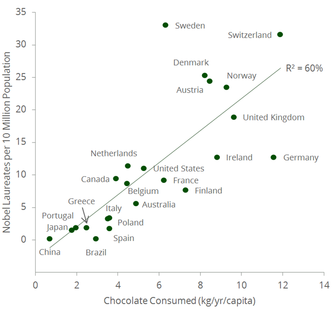<br>
  <font style="font-size:10px">from <a href="https://blog.dectech.co.uk/2016/04/06/why-is-correlation-not-causation-part-i/">dectech.co.uk</a></font>
</p>

]

---

.pull-left2[

# Kann das sein?

]

.pull-right7[

<br>

<p align = "center">
  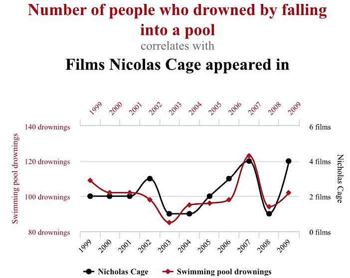<br>
  <font style="font-size:10px">from <a href="https://www.tylervigen.com/spurious-correlations">tylervigen.com</a></font>
</p>

]


---

.pull-left35[

# Das Modell der Inferenz-Statistik

<ul>
  <li class="m1"><span>Die Inferenz-Statistik geht i.A. davon aus, dass den Beobachtungen (Stichprobe) eine <high>wahre, unbeobachtete Welt</high> (Population) zugrunde liegt. </span></li>
  <li class="m2"><span>Ziel der Inferenz-Statistik ist es von der Stichprobe <high>auf die Population zu schliessen</high>.</span></li>
  <li class="m3"><span>Grundlage der Inferenz sind <high>Annahmen</high> darüber wie die Population <high>die Stichprobe generiert</high>.</span></li>
</ul>

]

.pull-right5[

<br>

<p align = "left" >
  
</p>

]


---

.pull-left35[

# Nullhypothese H0

<ul>
  <li class="m1"><span>Jede statistische Inferenz beginnt mit <high>Annahmen über die Population</high>.</span></li>
  <li class="m2"><span>In der klassischen Inferenz-Statistik ist <high>die wichtigste Annahme</high> die Nullhypothese H0.</span></li>
  <li class="m3"><span>Die Nullhypothese H0 dient...</span></li>
  <ul class=level>
    <li><span>Als Grundlage für die <high>Konstruktion des Tests</high>.</span></li>
    <li><span>Als <high>Vergleichsmasstab</high>.</span></li>
  </ul>
</ul>


]

.pull-right5[

<p align = "left" >
  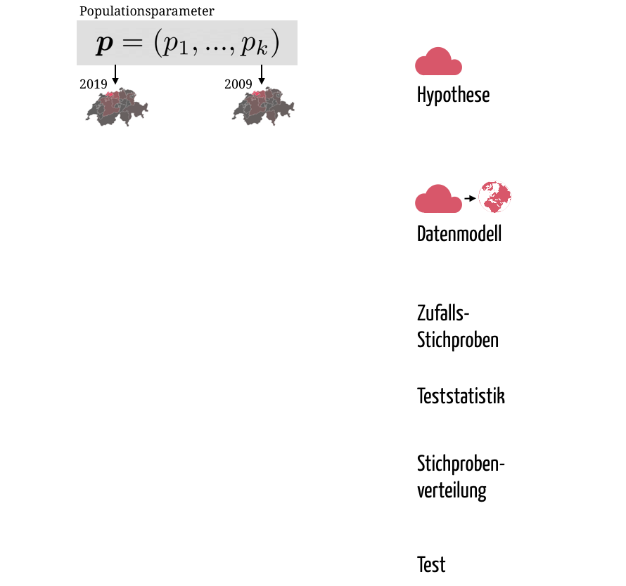
</p>

]

---

.pull-left35[

# Nullhypothese H0

<ul>
  <li class="m1"><span><high>Wahrscheinlichkeiten <mono><b>p</b></mono></high> unterliegen den beobachteten Häufigkeiten.</span></li>
</ul>


<p align = "center" >
  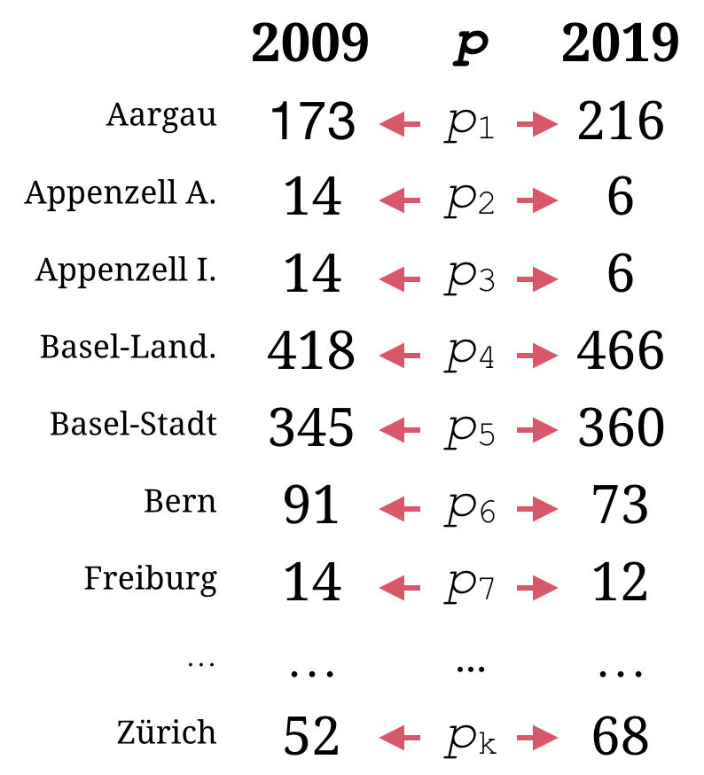
</p>

]

.pull-right5[

<p align = "left" >
  
</p>

]


---

.pull-left35[

# Datenmodell

<ul>
  <li class="m1"><span>Beschreibt wie, gegeben die H0, die <high>Stichproben verteilt sein sollten</high>.</span></li>
  <li class="m2"><span>Bedient sich i.d.R. bekannter <high>Wahrscheinlichkeitsverteilungen</high>.</span></li>
</ul>

<br>

$$Pr(Daten|H0) = Verteilung$$


]

.pull-right5[

<p align = "left" >
  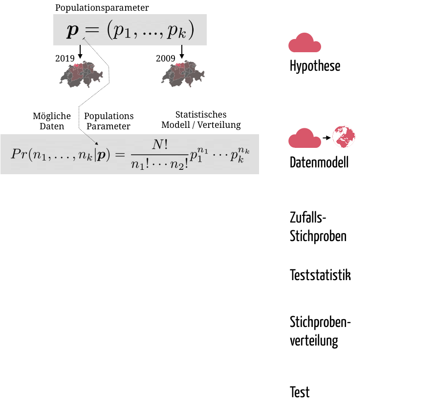
</p>

]

---

.pull-left35[

# Datenmodell

<ul>
  <li class="m1"><span>Weist jedem <high>Häufigkeitsmuster</high> eine <high>Wahrscheinlichkeit</high> zu gebeben <mono><b>p</b></mono>.</span></li>
</ul>


<p align = "center" >
  
</p>
]

.pull-right5[

<p align = "left" >
  
</p>

]


---

.pull-left35[

# Daten unter H0

<ul>
  <li class="m1"><span>Mithilfe des Datenmodells können <high>Stichproben unter der H0 simuliert werden</high>.</span></li>
</ul>

]

.pull-right5[

<p align = "left" >
  
</p>

]

---

.pull-left35[

# Teststatistik

<ul>
  <li class="m1"><span>Teststatistiken sind auf bestimmte Inferenztests <high>zugeschnittene deskriptive Statistiken</high>.</span></li>
  <li class="m2"><span>Beinhaltet i.d.R.:</span></li>
  <ul class="level">
    <li><span><high>Schätzung</high> der Elemente in der H0.</li></span>
    <li><span><high>Zusammenfassung</high> des relevanten Effekts/Zusammenhangs.</li></span>
  </ul>
</ul>

]

.pull-right5[

<p align = "left" >
  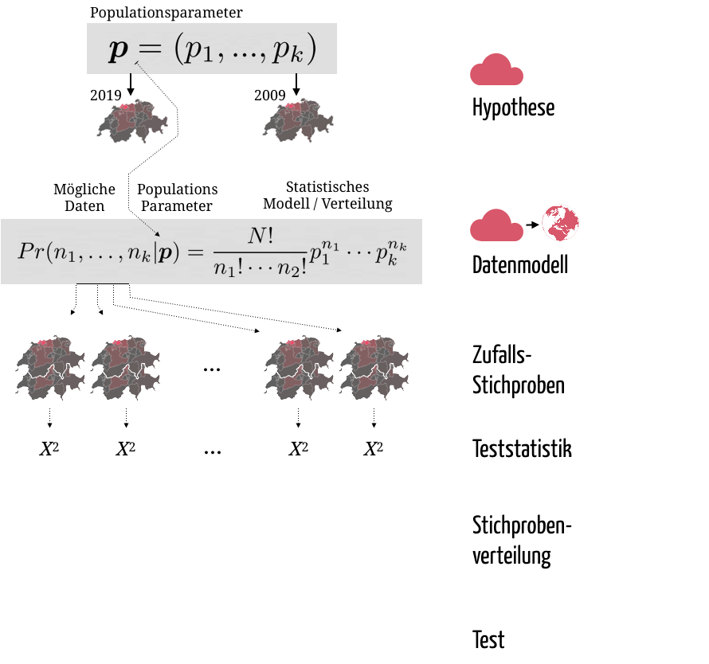
</p>

]


---

.pull-left35[

# Teststatistik

<ul>
  <li class="m1"><span>Die <mono><b>p</b></mono> werden geschätzt als <mono><b>p&#x0302;</b></mono>, die <high>relative Häufigkeit der Kantone</high> über die Jahre hinweg.</span></li>
</ul>


<p align = "center" >
  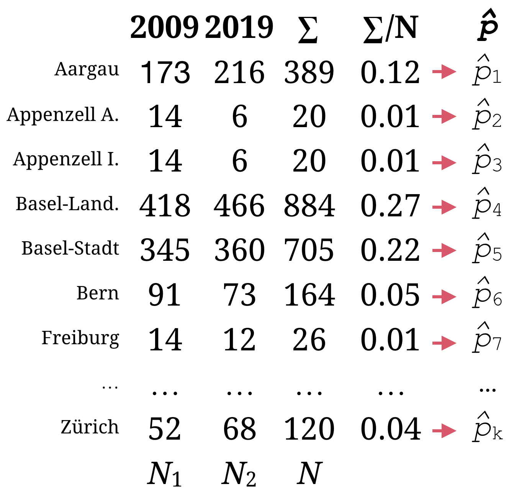
</p>


]

.pull-right5[

<p align = "left" >
  
</p>

]

---

.pull-left35[

# Teststatistik

<ul>
  <li class="m1"><span>Die X<sup>2</sup> Teststatistik summiert die <high>normalisierten, quadratischen Abweichungen</high> der auf Basis von <mono><b>p</b></mono> erwarteten Häufigkeiten.</span></li>
</ul>

<br>

<p align = "center" >
  
</p>


]

.pull-right5[

<p align = "left" >
  
</p>

]


---

.pull-left35[

# Stichprobenverteilung

<ul>
  <li class="m1"><span>Die Stichprobenverteilung ist die Verteilung von <high>deskriptiven Statistiken</high>,  die aus theoretischen (oder simulierten) <high>Stichproben aus der Population</high> berechnet werden.</span></li>
  <li class="m2"><span>Meist geht es um die <high>Verteilung der Teststatistik</high>.</span></li>
</ul>


]

.pull-right5[

<p align = "left" >
  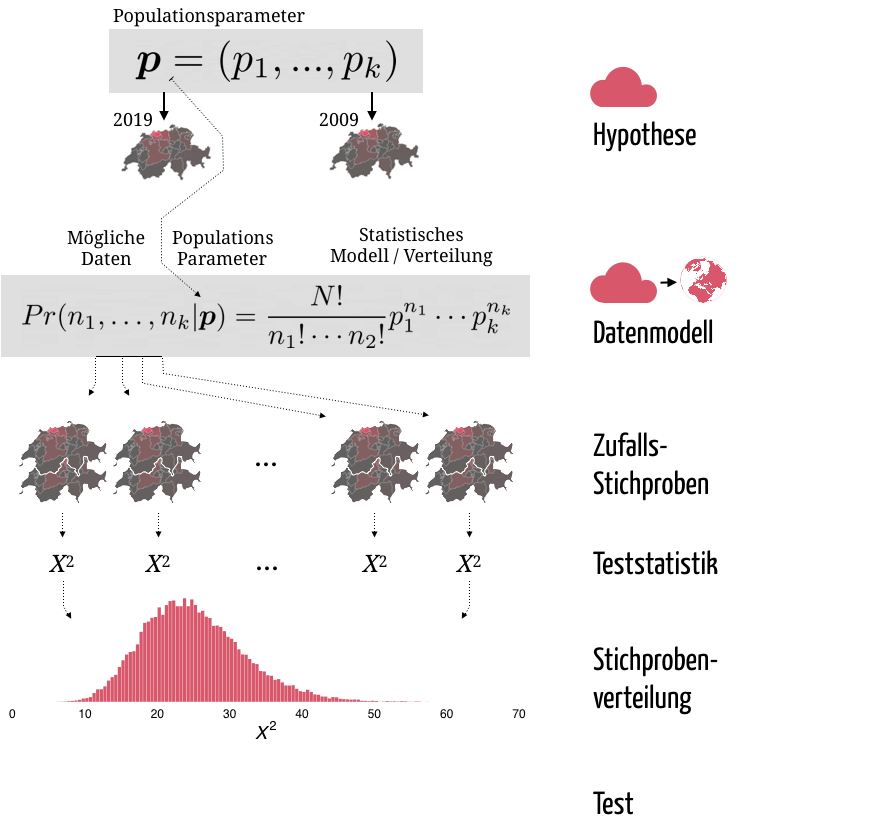
</p>

]

---

.pull-left35[

# <i>p</i>-Wert

<ul>
  <li class="m1"><span><high>Vergleich der beobachteten Werte mit der Stichprobenverteilung</high> unter H0 verrät wie konsistent die gemachten Beobachtungen mit der H0 sind.</span></li>
    <li class="m2"><span>Möglichkeiten</span></li>
    <ul class="level">
    <li><span><b>Likelihood</b></li></span>
    <li><span><high>Extremität</high></li></span>
    </ul> 
</ul>
]

.pull-right5[

<p align = "left" >
  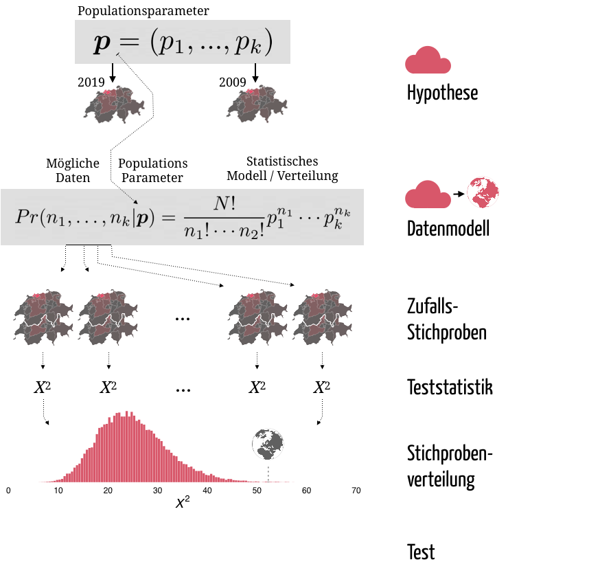
</p>

]


---

.pull-left35[

# <i>p</i>-Wert

<ul>
  <li class="m1"><span><i>p</i>-Wert ist die Wahrscheinlichkeit <high>unter H0 solche oder extremere Beobachtungen zu machen</high>.</span></li>
  <li class="m2"><span>Extremer kann in <high>eine oder beide Richtungen</high> bestimmt werden.</span></li>
</ul>

]

.pull-right5[

<p align = "left" >
  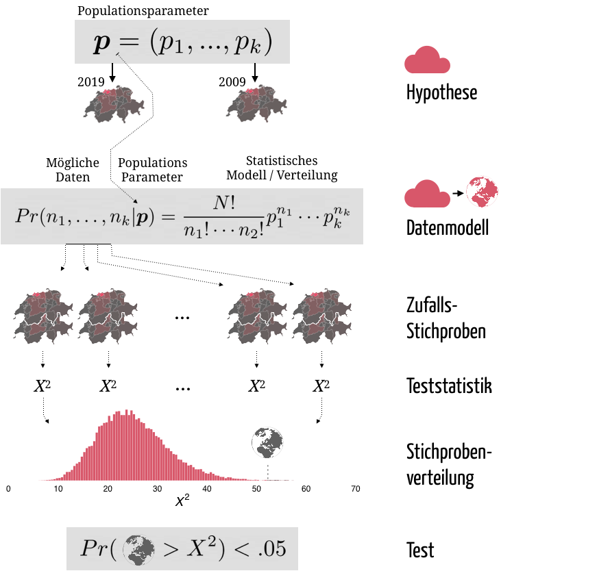
</p>

]

---

.pull-left35[

# Testverteilung

<ul>
  <li class="m1"><span>Meist ist die Form der <high>Stichprobenverteilung bereits bekannt</high>.</span></li>
  <li class="m2"><span>Für Fälle wie diesen ist dies die <high>&Chi;<sup>2</sup> Verteilung</high>.</span></li>
</ul>


]

.pull-right5[

<p align = "left" >
  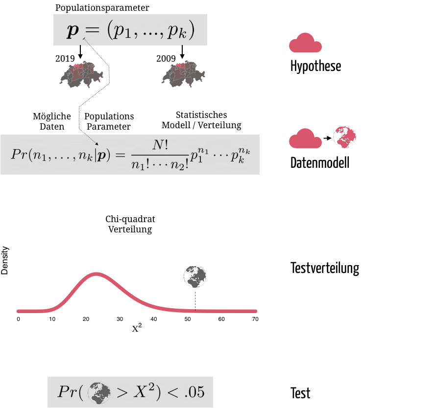
</p>

]

---

.pull-left35[

# Freiheitsgrade

<ul>
  <li class="m1"><span>Testverteilungen haben Parameter, die der <high>aktuellen Situation angepasst werden</high>.</span></li>
  <li class="m2"><span>Parameter.</span></li>
  <ul class="level">
  <li><span><high>Freiheitsgrade</high></li></span>
  <li><span>Nicht-Zentralität</li></span>
  <li><span>etc.</li></span>
  </ul>
</ul>


]

.pull-right5[

<p align = "left" >
  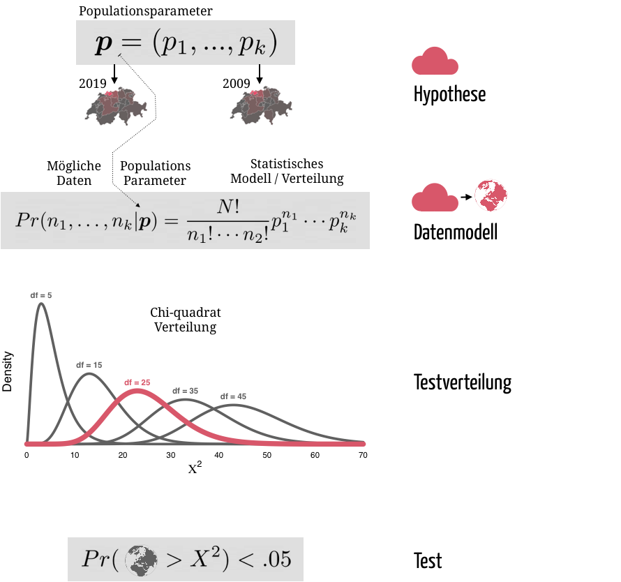
</p>

]


---

.pull-left35[

# Freiheitsgrade

<ul>
  <li class="m1"><span>Freiheitsgrade (degrees of freedom) drücken die <high>Anzahl der "freien" Beobachtungen</high> aus.</span></li>
</ul>

<br>

<p align = "center" >
  
</p>

]

.pull-right5[

<p align = "left" >
  
</p>

]

---

.pull-left35[

# Freiheitsgrade

<ul>
  <li class="m1"><span>Freiheitsgrade (degrees of freedom) drücken die <high>Anzahl der "freien" Beobachtungen</high> aus.</span></li>
</ul>

<p align = "center" style="margin-top:20px">
  
</p>

]

.pull-right5[

<p align = "left" >
  
</p>

]

---

# Die Normalverteilung

.pull-left35[

<ul>
  <li class="m1"><span>Traditionell das <high>Arbeitstier</high> der Inferenzstatistik.</span></li>
  <li class="m2"><span>Beschrieben durch</span></li>
  <ul class=level>
    <li><span>Mittelwert &mu;</span></li>
    <li><span>Standardabweichung &sigma;</span></li>
  </ul>
  <li class="m3">Folgt aus dem <high>zentralen Grenzwertsatz</high></span></li>
</ul>

<br>

$$\large p(x|\mu, \sigma) = \frac{1}{\sigma \sqrt 2\pi}e^{-(x-\mu)/2\sigma^2}$$

]

.pull-right5[

<p align = "left" >
  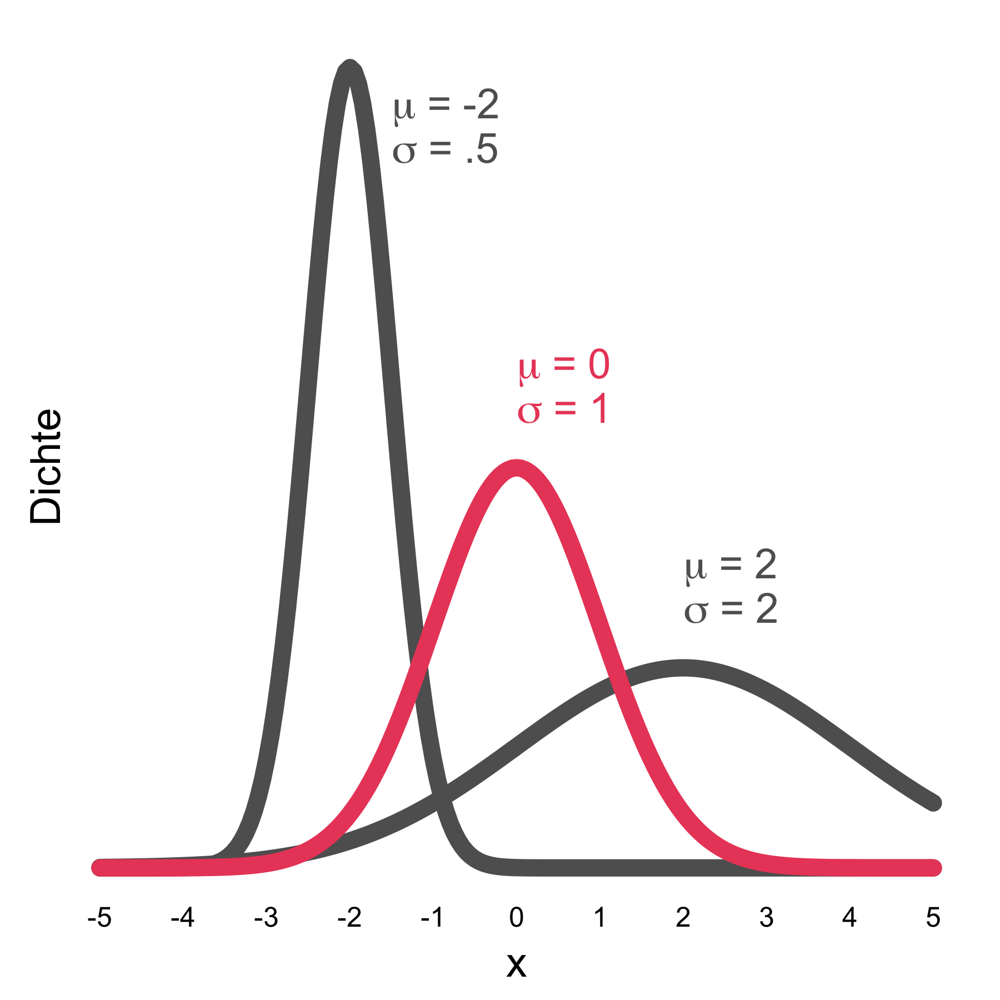
</p>

]


---

.pull-left35[

# Zentraler Grenzwertsatz 
<p style="margin-top:-30px"><font style="font-size:16px">oder warum die Welt normal ist</font></p>

<ul>
  <li class="m1"><span><high>Mittelwerte</high> egal welcher Verteilung <high>konvergieren gegen eine Normalverteilung</high> mit steigendem <mono>N</mono>.</span></li>
  <li class="m2"><span>Eigenschaften</span></li>
  <ul class=level>
    <li><span><high>Mittelwert</high> der Mittelwerte konvergiert gegen &mu;</span></li>
    <li><span><high>Standardabweichung</high> der Mittelwerte konvergiert gegen &sigma;/&#8730;n</span></li>
  </ul>
</ul>


$$ \large \bar{X} \xrightarrow{d} \mathcal{N}(\mu, \frac{\sigma}{\sqrt{n}}) $$

]

.pull-right5[

<br>

<p align ="left">
  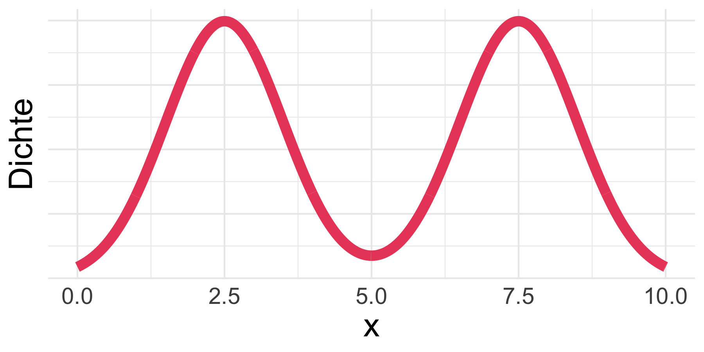
  <br><br>
  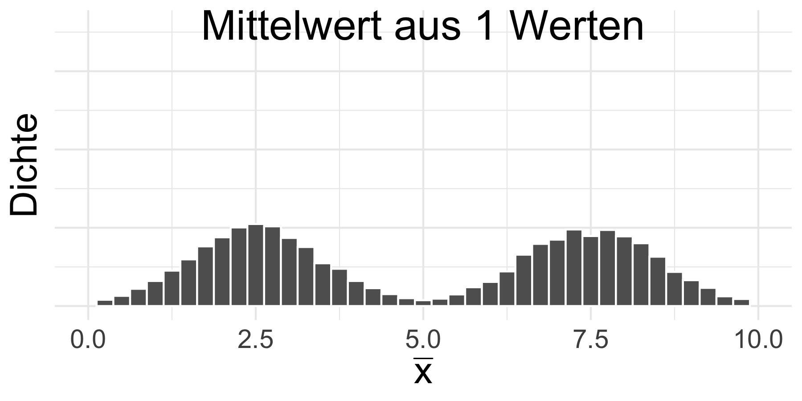
</p>

]

---

.pull-left35[

# Zentraler Grenzwertsatz 
<p style="margin-top:-30px"><font style="font-size:16px">oder warum die Welt normal ist</font></p>

<ul>
  <li class="m1"><span><high>Mittelwerte</high> egal welcher Verteilung <high>konvergieren gegen eine Normalverteilung</high> mit steigendem <mono>N</mono>.</span></li>
  <li class="m2"><span>Eigenschaften</span></li>
  <ul class=level>
    <li><span><high>Mittelwert</high> der Mittelwerte konvergiert gegen &mu;</span></li>
    <li><span><high>Standardabweichung</high> der Mittelwerte konvergiert gegen &sigma;/&#8730;n</span></li>
  </ul>
</ul>


$$ \large \bar{X} \xrightarrow{d} \mathcal{N}(\mu, \frac{\sigma}{\sqrt{n}}) $$

]

.pull-right5[

<br>

<p align ="left">
  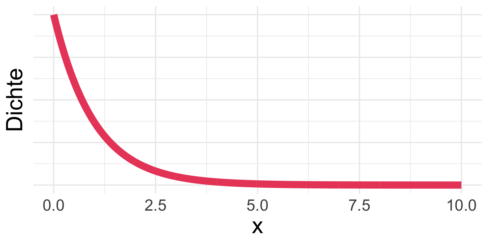
  <br><br>
  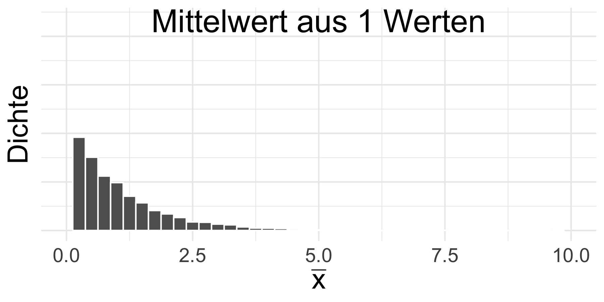
</p>

]


---
class: middle, center

<h1><a href="https://therbootcamp.github.io/SmR_2020Mai/index.html">Schedule</a></h1>


