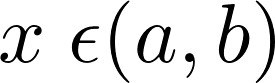
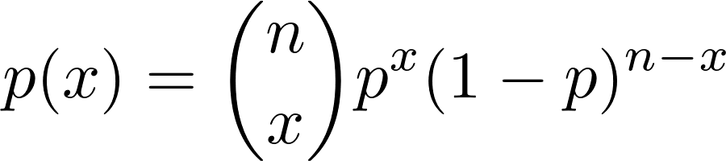

layout: true

<div class="my-footer">
  <span style="text-align:center">
    <span> 
      
    </span>
    <a href="https://therbootcamp.github.io/">
      <span style="padding-left:82px"> 
        <font color="#7E7E7E">
          www.therbootcamp.com
        </font>
      </span>
    </a>
    <a href="https://therbootcamp.github.io/">
      <font color="#7E7E7E">
       Statistil mit R | März 2020
      </font>
    </a>
    </span>
  </div> 

---

```{r, eval = TRUE, echo = FALSE, warning=F,message=F}
# Code to knit slides

```

```{r setup, include=FALSE}
options(htmltools.dir.version = FALSE)
# see: https://github.com/yihui/xaringan
# install.packages("xaringan")
# see: 
# https://github.com/yihui/xaringan/wiki
# https://github.com/gnab/remark/wiki/Markdown
options(width = 110)
options(digits = 4)

# Load packages
require(tidyverse)
library(cowplot)
library(ggpubr)

knitr::opts_chunk$set(fig.align = "center", warning = FALSE, message = FALSE, dpi = 300)


# Load data
baselers <- readr::read_csv("1_Data/baselers.csv")

# get color palette functions
source("../../_materials/palette/therbootcamp_palettes.R")

```


.pull-left45[

Statistik 

Lehre von den Daten über den Staat“


]

.pull-left55[


<p align = "center">
  <br>
  <font style="font-size:10px">from <a href="https://www.bytelion.com/services/datascience/">bytelion.com</a></font>
</p>


]


---

# Our goal in the next hour

.pull-left55[

In this hour, we will try to cover some of the <high>basic principles of statistical inference</high>.

1. *Variability*
2. *Sample statistics*
3. *Sampling (samples vs. populations)*
4. *Distributions*
5. *Likelihood*
6. *Null Hypothesis testing*
7. *Test statistic*
8. *P-values*

This is a lot to cover, and it may not be clear from the beginning. To help us, <high>we'll think about it in terms of beer</high>.

]


.pull-right35[

<p align="center">
  
  <br>
  <font style="font-size:10px">
    from <a href="https://cdn.lynda.com/course/">cdn.lynda.com</a>
  </font>
  <br><br>
  
  <br>
  <font style="font-size:10px">
    from <a href="https://marketingweek.imgix.net"> marketingweek.imgix.net</a>
  </font>
  
</p>

]


---

.pull-left45[

# Example

Basel has many nice "Buvette's" that serve drinks in warm months. 

The Oetlinger Buvette, one of our favorites, offers 33cl beers (or so they say...).

> I am convinced that the Oetlinger Buvette 'underpouring' its beers and they are not truly 33cl.

#### How can I find out?

How can I formulate my belief into an <high>formal hypothesis?</high>

How can I collect <high>data to test the hypothesis?</center></high>

What do you think?

]


.pull-right45[

<br><br>

<p align="center">
  
  <br>
  <font style="font-size:10px">
    from <a href="https://www.basel.com/">basel.com</a>
  </font>
  <br><br>
  
  <br>
  <font style="font-size:10px">
    from <a href="https://files.newsnetz.ch"> newsnetz.ch</a>
  </font>
  
</p>

]

---

.pull-left5[

```{r, echo= FALSE}
beer <- c(28, 31, 28, 37, 30, 33, 25, 33, 24, 30)
beer_data <- tibble(beer, id = 1:length(beer))
```


# Beer hypothesis

The mean amount poured in 33cl beers by the Oetlinger Buvette is less than 33cl:


$$\Large H1: \mu < 33$$

### Beer Data

I ordered 10 beers, and measured the exact amount in each cup, here are the results:

```{r, echo= FALSE}
beer <- c(28, 31, 28, 37, 30, 33, 25, 33, 24, 30)
beer_data <- tibble(beer, id = 1:length(beer))
```


```{r, echo = FALSE, out.width = "80%", fig.align = 'center', fig.width = 4.5, fig.height = 2.7}
beer_gg <- ggplot(beer_data, aes(x = id, y = beer)) +
  geom_hline(yintercept = 33, col = baselrbootcamp_cols("green")) +
  geom_text(data = beer_data %>% filter(beer > 30), aes(label = beer), nudge_y = 2) +
    geom_text(data = beer_data %>% filter(beer <= 30), aes(label = beer), nudge_y = -2) +
  scale_x_continuous(breaks = 1:10) +
  labs(y = "Amount in cl", title = "10 beers from Oetlinger Buvette") +
  ylim(c(20, 40)) +
  geom_point(size = 2.5)

beer_gg
```

]


.pull-right45[

<br><br>

<p align="center">
  
  <br>
  <font style="font-size:10px">
    from <a href="https://www.basel.com/">basel.com</a>
  </font>
  <br><br>
  
  <br>
  <font style="font-size:10px">
    from <a href="https://files.newsnetz.ch"> newsnetz.ch</a>
  </font>
  
</p>

]


---


# 1. Variability

.pull-left45[

All interesting data processes have <high>variability</high>

- Stock prices change over time, 
- Individual patients respond to drugs differently

Statistical inference is all about <high>accounting for variability</high>

If there was no variability, there would be no need to do statistics.

*If every single patient responded the exact same way to a drug, you could do a clinical trial with (any) one patient.*


]


.pull-right45[

<p align="center">
  
</p>

]


---

# 1. Variability

.pull-left45[


There are two types of variability: <high>systematic and unsystematic variability</high>.

Statistical inference typically seeks to <high>separate total variability into systematic and unsystematic portions</high>.

<br>

|Variability Type|Definition|
|:-----|:-----|
|Systematic| Variation that <high>can</high> be explained by known variables|
|Unsystematic |Variation that <high>cannot</high> be explained by known variables|

]


.pull-right45[


```{r, echo = FALSE}

set.seed(103)
x <- rnorm(50, mean = 50, sd = 10)


id <- 1:50
income <- rnorm(n = 50, mean = 7000, sd = 1000)
exercise <- rnorm(n = 50, mean = 30, sd = 10)
beer <- sample(c(0, 1), size = 50, replace = TRUE)
sex <- sample(c(0, 1), size = 50, replace = TRUE)
happiness <- rnorm(50)
happiness[beer == 1] <- .2 * exercise + 2 + rnorm(sum(beer == 1), mean = 0, sd = 1) - 2
happiness[beer == 0] <- .2 * exercise - 2 + rnorm(sum(beer == 0), mean = 0, sd = 1) - 2
happiness2 <- .2 * exercise + rnorm(50, mean = 0, sd = 1) - 2


dat <- tibble(id, income, exercise, happiness, happiness2, group = rep("Baselers", 50))

overall <- ggplot(dat, aes(x = id, y = happiness)) +
  geom_point() +
  labs(y = "Happiness",
       x = "ID",
       title = "Total Variability in Happiness")


low_fact <- ggplot(dat, aes(factor(sex), happiness)) +
  geom_jitter(width = .05) +
  labs(y = "Happiness",
       x = "Sex",
       title = "Low Variance Explained") +
  scale_y_continuous(breaks = seq(0, 10, 1), limits = c(1, 10))

high_fact <- ggplot(dat, aes(factor(beer), happiness)) +
  geom_jitter(width = .05) +
  labs(y = "Happiness",
       x = "Beer",
       title = "High Variance Explained") +
  scale_y_continuous(breaks = seq(0, 10, 1), limits = c(1, 10))


low_cont <- ggplot(dat, aes(income, happiness2)) +
  geom_point() +
  geom_smooth(method = "lm") +
  labs(y = "Happiness",
       x = "Income",
       title = "Low Variance Explained") +
  scale_y_continuous(breaks = seq(0, 10, 1), limits = c(1, 10))

high_cont <- ggplot(dat, aes(exercise, happiness2)) +
  geom_point() +
  geom_smooth(method = "lm") +
  labs(y = "Happiness",
       x = "Minutes of Exercise per day",
       title = "High Variance Explained")+
  scale_y_continuous(breaks = seq(0, 10, 1), limits = c(1, 10))

```


```{r, echo = FALSE, fig.width = 4, fig.height = 4, dpi= 200, out.width = "100%"}
overall #+ scale_x_continuous(seq(1, 50, 1))
```


]


---


# 1. Variability

.pull-left45[


There are two types of variability: <high>systematic and unsystematic variability</high>.

Statistical inference typically seeks to <high>separate total variability into systematic and unsystematic portions</high>.

<br>

|Variability Type|Definition|
|:-----|:-----|
|Systematic| Variation that <high>can</high> be explained by known variables|
|Unsystematic |Variation that <high>cannot</high> be explained by known variables|

]


.pull-right45[

```{r, echo = FALSE, fig.width = 6, fig.height = 6, dpi= 200, out.width = "100%"}
ggpubr::ggarrange(low_fact, high_fact, low_cont, high_cont, ncol = 2, nrow = 2)
```

]

---

.pull-left45[

# 2. Sample Statistics

Once we collect data, we always look for ways to <high>summarise</high> the data into <high>sample statistics</high>

Sample statistics give us <high>estimates</high> of key model parameters (more on this later) and usually (but not always) fall into one of two types:

<br>

|Type|Examples |
|:----|:------|
|Central Tendency| Mean, mode, median|
|Variability|Standard deviation, variance, range|


]


.pull-right45[

<br><br>

```{r, echo = FALSE, fig.width = 4, fig.align="left", fig.height = 3, dpi = 200, out.width = "100%"}
ggplot(beer_data, aes(x = id, y = beer)) +
  geom_text(data = beer_data %>% filter(beer > 30), aes(label = beer), nudge_y = 2) +
    geom_text(data = beer_data %>% filter(beer <= 30), aes(label = beer), nudge_y = -2) +
  scale_x_continuous(breaks = 1:10) +
  labs(y = "Amount in cl", title = "10 beers from Oetlinger Buvette") +
  ylim(c(20, 40)) +
  geom_hline(yintercept = mean(beer_data$beer), col = baselrbootcamp_cols("green"), size = 1.5) +
  geom_segment(aes(x = id, y = beer, xend = id, yend = 29.9), col = baselrbootcamp_cols("yellow"), lty = 1, size= 1.5) +
  annotate(geom = "segment", x = 2, xend = 2, y = 22 - 3.9 / 2, yend = 22 + 3.9 / 2, size = 1.5, col = baselrbootcamp_cols("yellow")) +
  annotate(geom = "label", x = 4, y = 22.5, label = "Std Deviation = 3.90", cex = 3) +
  annotate(geom = "label", x = 7, y = 30, label = "Mean = 29.9", cex = 3) +
  geom_point(size = 2.5)
```


$$Mean = \frac{28+31+28+...}{10} = 29.9$$

$$Stand. \; Dev. = \sqrt{\frac{(28-29.9)^2+(31-29.9)^2+...}{10-1}} = 3.90$$


]


---

.pull-left45[

# 3. Sampling Procedures

In statistics, we always distinguish between a <high>sample</high> and a </high>population</high>

Populations are what we are really interested in
- How will *all cancer patients* be affected by Drug X?
- How will *future stocks* change?
- Or is the pouring amount different from 33cl?

To learn about the population, we must use <high>sampling procedures</high> to obtain a <high>sample</high> of cases.

Then, inferential statistics allows us to <high>inferences</high> to populations.


]


.pull-right45[

<br><br><br>

```{r, echo = FALSE}
knitr::include_graphics("https://raw.githubusercontent.com/therbootcamp/SwR_2019Apr/master/src/img/sampling_procedure.png?token=AIFo1AUl-Ddz-zYZgoGbzwJoW8SO3LhUks5criQVwA%3D%3D")
```

]

---

.pull-left45[

# 4. Distributions

(Parametric) statistics is built on <high>calculating the likelihood of data</high> given a probability distribution.

A probability distribution is a <high>mathematical formula</high> that precisely defines <high>how likely</high> every possible value in a dataset is. [List of distributions](https://en.wikipedia.org/wiki/List_of_probability_distributions).

#### 3 key aspects of a distribution

1. <high>Probability Density Function (PDF)</high> - Formula defining the distribution (R knows these)

2. <high>Support</high> - What values can x take on?

3. <high>Parameters</high> - Values that allow you to change the shape of the distribution? (e.g.; mean and variability?)


]


.pull-right45[

<br><br><br><br>

```{r, echo = FALSE, fig.width = 4, fig.height = 4, out.width = "100%", dpi=200}

p1 <- ggplot(data = data.frame(x = c(60, 140)), aes(x)) +
  stat_function(fun = dnorm, n = 1001, args = list(mean = 110, sd = 10), col = baselrbootcamp_cols("green"),size = 2) + 
    stat_function(fun = dnorm, n = 1001, args = list(mean = 90, sd = 5), col = baselrbootcamp_cols("yellow"),size = 2) + 
  ylab("Likelihood") +
  scale_y_continuous(breaks = NULL) +
  xlab("x") +
  annotate("text", x = 90, .09, label =parse(text = paste0('mu == 90 ~ sigma == 5')), size = 5) +
annotate("text", x = 120, .05, label =parse(text = paste0('mu == 110 ~ sigma == 10')), size = 5) +
  ylim(c(0, .1))

  
p1
```


]


---

# Normal Distribution

.pull-left45[


A *bell-shaped curve* aka Gaussian distribution, which is the <high>most important distribution in all of statistics</high>.

<br>

```{r, echo = FALSE, fig.width = 4, fig.height = 2.5, out.width = "100%", dpi=200}

p1
```

]


.pull-right45[

<table style="cellspacing:0; cellpadding:0; border:none; padding-top:10px" width=100%>
  <col width="30%">
  <col width="70%">
<tr>
  <td bgcolor="white" style="padding-bottom:42px">
    <b>Aspect</b>
  </td>
  <td bgcolor="white" style="padding-bottom:42px">
    <b>Formula</b>
  </td>  
</tr>
<tr>
  <td bgcolor="white"" style="padding-bottom:42px;padding-top:42px">
    <i>PDF</i>
  </td>
  <td bgcolor="white">
    
  </td>  
</tr>
<tr>
  <td bgcolor="white"" style="padding-bottom:42px;padding-top:42px">
    <i>Support</i>
  </td>
  <td bgcolor="white">
    
  </td>  
</tr>
<tr>
  <td bgcolor="white"" style="padding-bottom:42px;padding-top:42px">
    <i>Parameters</i>
  </td>
  <td bgcolor="white">
     &nbsp;&nbsp;&nbsp;&nbsp; (Center; mean)<br><br>
      &nbsp;&nbsp;&nbsp;&nbsp; (Variability; stand. dev.)<br>
  </td>  
</tr>
</table>


]

---

# Uniform Distribution

.pull-left45[

A 'Flat distribution', used <high>when everything is equally likely</high>, within a range.

<br>

```{r, echo = FALSE, fig.width = 4, fig.height = 2.5, out.width = "100%", dpi=200}

p1 <- ggplot(data = data.frame(x = c(60, 130)), aes(x)) +
  stat_function(fun = dunif, n = 1001, args = list(min = 80, max = 120), col = baselrbootcamp_cols("green"),size = 2) + 
    stat_function(fun = dunif, n = 1001, args = list(min = 70, max = 85), col = baselrbootcamp_cols("yellow"),size = 2) + 
  ylab("Likelihood") +
  scale_y_continuous(breaks = NULL) +
  xlab("x") +
  annotate("text", x = 77.5, .08, label =parse(text = paste0('a == 70 ~ b == 85')), size = 5) +
annotate("text", x = 105, .035, label =parse(text = paste0('a == 80 ~ b == 120')), size = 5) +
  ylim(c(0, .1))

  
p1
```

]


.pull-right45[

<table style="cellspacing:0; cellpadding:0; border:none; padding-top:10px" width=100%>
  <col width="30%">
  <col width="70%">
<tr>
  <td bgcolor="white" style="padding-bottom:42px">
    <b>Aspect</b>
  </td>
  <td bgcolor="white" style="padding-bottom:42px">
    <b>Formula</b>
  </td>  
</tr>
<tr>
  <td bgcolor="white"" style="padding-bottom:42px;padding-top:42px">
    <i>PDF</i>
  </td>
  <td bgcolor="white">
    
  </td>  
</tr>
<tr>
  <td bgcolor="white"" style="padding-bottom:42px;padding-top:42px">
    <i>Support</i>
  </td>
  <td bgcolor="white">
    
  </td>  
</tr>
<tr>
  <td bgcolor="white"" style="padding-bottom:42px;padding-top:42px">
    <i>Parameters</i>
  </td>
  <td bgcolor="white">
     &nbsp;&nbsp;&nbsp;&nbsp; (Minimum)<br><br>
      &nbsp;&nbsp;&nbsp;&nbsp; (Maximum)<br>
  </td>  
</tr>
</table>

]

---

# Binomial Distribution

.pull-left5[

A discrete "Counting" distribution answering: If I flip a coin N times, with p(Head) = p, how many times will I get heads?

```{r, echo = FALSE, fig.width = 4, fig.height = 3, out.width = "100%", dpi=200}

d1 <-  data.frame(x = seq(0, 10, 1),
                               y = dbinom(seq(0, 10, 1), size = 10, prob = .5))


d2 <-  data.frame(x = seq(0, 10, 1),
                               y = dbinom(seq(0, 10, 1), size = 10, prob = .1))


p1 <- ggplot(data =d2, 
             aes(x = x, y = y)) +
  geom_point(data = d1, col = baselrbootcamp_cols("green"), size = 2) +
  geom_line(data = d1, size = .5, col = "black", lty = 3) + 
  geom_point(data = d2, col = baselrbootcamp_cols("yellow"), size = 2) +
  geom_line(data = d2, size = .5, col = "black", lty = 3) + 
  ylab("Likelihood") +
  ylim(0, .5) + 
  annotate("text", x = 2, y = .45, label =parse(text = paste0('p == .1 ~ n== 10')), size = 5) +
  annotate("text", x = 5, y = .3, label =parse(text = paste0('p == .5 ~ n== 10')), size = 5) +
  scale_x_continuous(breaks = 0:10)

p1

```

]


.pull-right45[

<table style="cellspacing:0; cellpadding:0; border:none; padding-top:10px" width=100%>
  <col width="30%">
  <col width="70%">
<tr>
  <td bgcolor="white" style="padding-bottom:42px">
    <b>Aspect</b>
  </td>
  <td bgcolor="white" style="padding-bottom:42px">
    <b>Formula</b>
  </td>  
</tr>
<tr>
  <td bgcolor="white" style="padding-bottom:42px;padding-top:42px">
    <i>PDF</i>
  </td>
  <td bgcolor="white">
    
  </td>  
</tr>
<tr>
  <td bgcolor="white" style="padding-bottom:42px;padding-top:42px">
    <i>Support</i>
  </td>
  <td bgcolor="white">
    
  </td>  
</tr>
<tr>
  <td bgcolor="white" style="padding-bottom:42px;padding-top:42px">
    <i>Parameters</i>
  </td>
  <td bgcolor="white">
     &nbsp;&nbsp;&nbsp;&nbsp; (p(success))<br><br>
      &nbsp;&nbsp;&nbsp;&nbsp; (No. trials)<br>
  </td>  
</tr>
</table>

]


---

.pull-left45[

# 5: Likelihood

Why do we need distributions? To calculate <high>likelihoods</high> of data.

> How likely is it that I would get this trial result if the drug is *really* better than a placebo?

Knowing this likelihood allows us to <high>fit parameters</high>, <high>test</high> models, and make <high>predictions</high> about future data


> Given that out of 50 trial patients, the average recovery time was 2.3 days, what is the most likely distribution of recovery times for future patients?

]


.pull-right45[

<br><br>

<p align = "center">
  <br>
  <font style="font-size:10px">
    An ad for xofluza, from <a href="https://www.xofluza.com"> xofluza.com</a>
  </font>
</p>


```{r, echo = FALSE, fig.width = 3.5, fig.height = 2.5, out.width = "75%"}

set.seed(105)
x <- rnorm(50, mean = 50, sd = 10)

id <- 1:50
drug <- sample(c("Drug", "Placebo"), size = 50, replace = TRUE)
effect <- rnorm(50)
effect[drug == "Drug"] <- 2.3 + rnorm(sum(drug == "Drug"), mean = 0, sd = 1.5) - .41
effect[drug == "Placebo"] <- 3.3 + rnorm(sum(drug == "Placebo"), mean = 0, sd = 1.5) - .12

dat <- tibble(id, drug, effect, group = rep("Baselers", 50))
avg <- dat %>%
  group_by(drug) %>%
  summarise(days_mean = mean(effect))

drug_placebo_gg <- ggplot(dat, aes(factor(drug), effect)) +
  geom_jitter(width = .05) +
  labs(y = "Days",
       x = "Condition",
       title = "Fictional data comparing Drug to Placebo arm") +
  scale_y_continuous(breaks = seq(0, 10, 1), limits = c(0, 7)) +
  geom_label(data = avg, aes(x = drug, y = days_mean, label = round(days_mean, 2))) +
  theme(plot.title = element_text(size = 10))

drug_placebo_gg
```


```{r, eval = FALSE, echo = FALSE, fig.width = 4, fig.height = 3, out.width = "80%", dpi=200}

p1 <- ggplot(data = data.frame(x = c(0, 10)), aes(x)) +
  stat_function(fun = dnorm, n = 1001, args = list(mean = 3, sd = 2), col = baselrbootcamp_cols("green"),size = 2) + 
    stat_function(fun = dnorm, n = 1001, args = list(mean = 1, sd = 3), col = baselrbootcamp_cols("yellow"),size = 2) + 
  ylab("Likelihood") +
  scale_y_continuous(breaks = NULL) +
  xlab("x") +
  annotate("text", x = 3, .23, label =parse(text = paste0('mu == 3 ~ sigma == 2')), size = 5) +
annotate("text", x = 2, .15, label =parse(text = paste0('mu == 1 ~ sigma == 3')), size = 5) +
  ylim(c(0, .25)) +
  scale_x_continuous(breaks = 0:10)

  
p1

```


]

---

.pull-left45[

# 5: Likelihood

Using the binomial distributions on the right, answer the following questions:

### Q1

If there is a 50% chance of a clinical trial being successful, then out of 10 drugs, <high>how likely is it that exactly 5 will be successful</high>?


### Q2

If there is a 10% chance that a customer will default on his/her loan, then out of 10 customers, <high>how likely is it that none (0) will default</high>?

]


.pull-right5[

<br><br><br><br>

```{r, echo = FALSE, fig.width = 4, fig.height = 3.35, out.width = "100%", dpi=200}

d1 <-  data.frame(x = seq(0, 10, 1),
                               y = dbinom(seq(0, 10, 1), size = 10, prob = .5))

d2 <-  data.frame(x = seq(0, 10, 1),
                               y = dbinom(seq(0, 10, 1), size = 10, prob = .1))


p1 <- ggplot(data =d2, 
             aes(x = x, y = y)) +
  geom_hline(yintercept =  seq(0, .5, .1), col = "gray", size = .3, alpha = .5) +
  geom_vline(xintercept =  seq(0, 10), col = "gray", size = .3, alpha = .5) +
  geom_point(data = d1, col = baselrbootcamp_cols("green"), size = 2) +
  geom_line(data = d1, size = .5, col = "black", lty = 3) + 
  geom_point(data = d2, col = baselrbootcamp_cols("yellow"), size = 2) +
  geom_line(data = d2, size = .5, col = "black", lty = 3) + 
  ylab("Likelihood") +
  ylim(0, .5) + 
  annotate("text", x = 2, y = .45, label =parse(text = paste0('p == .1 ~ n== 10')), size = 5) +
  annotate("text", x = 5, y = .3, label =parse(text = paste0('p == .5 ~ n== 10')), size = 5) +
  scale_x_continuous(breaks = 0:10)

p1

```


]


---

.pull-left45[


# 6: Null hypothesis testing


Null hypothesis testing is a statistical framework where one hypothesis (H<sub>0</sub>) is tested to defend the other, alternative hypothesis (H<sub>1</sub>).

This evaluation is performed by calculating the likelihood of obtaining the data <high>assuming</high> that the null hypothesis true.

<table style="cellspacing:0; cellpadding:0; border:none; padding-top:10px" width=100%>
  <col width="16%">
  <col width="44%">
  <col width="40%">
<tr>
  <td bgcolor="white">
    <b>Hypothesis</b>
  </td>
  <td bgcolor="white">
    <b>Description</b>
  </td>  
  <td bgcolor="white">
    <b>Example</b>
  </td>  
</tr>
<tr>
  <td bgcolor="white">
    Null (H<sub>0</sub>)
  </td>
  <td bgcolor="white">
    A proposed effect <high>does not exist</high> and variation <high>is not systematic</high>.
  </td>  
  <td bgcolor="white">
    Drug and placebo have the same effect.
  </td>  
</tr>
<tr>
  <td bgcolor="white">
    Alternative (H<sub>1</sub>)
  </td>
  <td bgcolor="white">
    A proposed effect <high>does exist</high> and variation <high>is systematic</high>
  </td>  
  <td bgcolor="white">
    Drug and placebo do *not* have the same effect
  </td>  
</tr>
</table>

]


.pull-right45[

<br><br><br><br>


```{r, echo = FALSE, fig.width = 3, fig.height = 3, fig.cap }
drug_placebo_gg
```


]


---


.pull-left45[

# 7: Test statistics

Sample statistics (like means and standard deviations) are converted into <high>test statistics</high>.

Test statistics are unit-free numbers that help you quantify how likely data is given a null hypothesis. The <high>more extreme</high> (i.e.; highly positive or highly negative) your test statistic is, the <high>more evidence against</high> the null hypothesis.

<table style="cellspacing:0; cellpadding:0; border:none; padding-top:10px" width=100%>
  <col width="40%">
  <col width="60%">
<tr>
  <td bgcolor="white">
    <b>Test</b>
  </td>
  <td bgcolor="white">
    <b>Test statistic</b>
  </td>  
</tr>
<tr>
  <td bgcolor="white">
    t-test
  </td>
  <td bgcolor="white">
    t-statistic
  </td>  
</tr>
<tr>
  <td bgcolor="white">
    Correlation test
  </td>
  <td bgcolor="white">
    Correlation coefficient
  </td>  
</tr>
<tr>
  <td bgcolor="white">
    Binomial
  </td>
  <td bgcolor="white">
    Number of successes
  </td>  
</tr>
</table>


]


.pull-right45[

<br><br><br><br>

<p align = "center">
  
</p>

]

---
.pull-left55[

# 8: P-value

*p*-values are used to quantify the likelihood of data given the <high>probability distribution</high> under the <high>null hypothesis (H0)</high>.

If a p-value is *small* (i.e.; p < .05), this means that the likelihood of obtaining that data given the null hypothesis is *small*, suggesting that the null hypothesis is *wrong*.

#### Formally

A p-value is the probability of obtaining a test statistic as extreme or more extreme than what you got assuming a null hypothesis is true

#### Decision rule

<font style="font-size:32px"><high>p < .05 &rarr; Reject H<sub>0</0></high></font>

*The data are too unlikely to occcur if H0 was really true (therefore I conclude H0 must not be true)*

]


.pull-right4[

<br><br>

<p align = "center">
  
</p>

]

---


.pull-left45[

# What about Oetlinger?

<table style="cellspacing:0; cellpadding:0; border:none; padding-top:10px" width=100%>
  <col width="30%">
  <col width="70%">
<tr>
  <td bgcolor="white">
    <b>Step</b>
  </td>
  <td bgcolor="white">
    <b>Result</b>
  </td>  
</tr>
<tr>
  <td bgcolor="white">
    H<sub>0</sub>
  </td>
  <td bgcolor="white">
    The mean amount of beer poured by Oetlinger is 33ml.
  </td>  
</tr>
<tr>
  <td bgcolor="white">
    Sample statistics
  </td>
  <td bgcolor="white">
    Mean = 33<br>Std. Deviation = 3.90.
  </td>  
</tr>
<tr>
  <td bgcolor="white">
    Test and <i>p</i>-value
  </td>
  <td bgcolor="white">
    We calculated, based on the sample statistics, a test statistic of <high><i>t</i>=-2.51</high> and a <high>p-value</high> of <high><i>p</>=0.0273</high>
  </td>  
</tr>
</table>

<high>Conclusion</high> - Using a p < 0.05 threshold, we conclude that the null hypothesis is likely wrong and that...the Oetlinger buvette is pouring less than 33cl!

*Note: These data are completely made up :) We're sure the Oetlinger Buvette is not ripping us off*

]


.pull-right5[

<br>

<p align = "center">
  
</p>

]


---


.pull-left45[

# What about Oetlinger?

<table style="cellspacing:0; cellpadding:0; border:none; padding-top:10px" width=100%>
  <col width="30%">
  <col width="70%">
<tr>
  <td bgcolor="white">
    <b>Step</b>
  </td>
  <td bgcolor="white">
    <b>Result</b>
  </td>  
</tr>
<tr>
  <td bgcolor="white">
    H<sub>0</sub>
  </td>
  <td bgcolor="white">
    The mean amount of beer poured by Oetlinger is 33ml.
  </td>  
</tr>
<tr>
  <td bgcolor="white">
    Sample statistics
  </td>
  <td bgcolor="white">
    Mean = 29.9 <br>Std. Deviation = 3.90.
  </td>  
</tr>
<tr>
  <td bgcolor="white">
    Test and <i>p</i>-value
  </td>
  <td bgcolor="white">
    We calculated, based on the sample statistics, a test statistic of <high><i>t</i>=-2.51</high> and a <high>p-value</high> of <high><i>p</>=0.0273</high>
  </td>  
</tr>
</table>


<high>Conclusion</high> - Using a p < 0.05 threshold, we conclude that the null hypothesis is likely wrong and that...the Oetlinger buvette is pouring less than 33cl!

*Note: These data are completely made up :) We're sure the Oetlinger Buvette is not ripping us off*

]


.pull-right5[

<br>

### T-test in R

```{r}
# Define beer sample
beer <- c(28, 31, 28, 37, 30, 
          33, 25, 33, 24, 30)

# Conduct one-sample t-test
t.test(x = beer,   # Sample values
       mu = 33)    # Null Hypothesis
```


]


---
class: middle, center

# Questions?

<h1><a href="https://therbootcamp.github.io/SwR_2019Apr/index.html">Schedule</a></h1>


