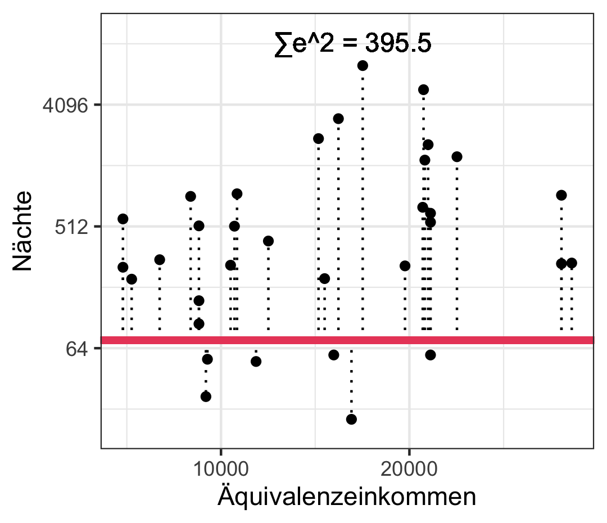
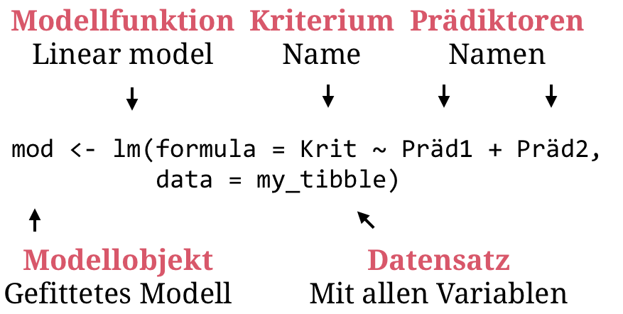

layout: true

<div class="my-footer">
  <span style="text-align:center">
    <span> 
      
    </span>
    <a href="https://therbootcamp.github.io/">
      <span style="padding-left:82px"> 
        <font color="#7E7E7E">
          www.therbootcamp.com
        </font>
      </span>
    </a>
    <a href="https://therbootcamp.github.io/">
      <font color="#7E7E7E">
       Datascience mit R | FS 2021
      </font>
    </a>
    </span>
  </div> 

---

```{r, eval = TRUE, echo = FALSE, warning=F,message=F}
# Code to knit slides

```

```{r setup, include=FALSE}
options(htmltools.dir.version = FALSE)
options(width = 110)
options(digits = 4)

# Load packages
require(tidyverse)

print2 <- function(x, nlines=10,...) {
   cat(head(capture.output(print(x,...)), nlines), sep="\n")}

# Load data
baselers <- readr::read_csv("1_Data/baselers.csv")

# get color palette functions
source("../../_materials/palette/therbootcamp_palettes.R")
colors = baselrbootcamp_colors

knitr::opts_chunk$set(dpi = 300, echo = FALSE, warning = FALSE, fig.align = 'center', message= FALSE)
```


# Lineare Modelle

.pull-left4[

<ul>
  <li class="m1"><span>Die <high>meisten inferenzstatistischen Tests</high> gehören zur Klasse der linearen Modelle.</span></li>
  <li class="m2"><span>Beispiele</span></li>
  <ul class="level">
    <li><span><high>Regression</high></li></span>
    <li><span><high>t-Test<high></li></span>
    <li><span><high>Varianzanalyse (ANOVA)</high></li></span>
    <li><span>Mediationsanalyse</li></span>
    <li><span>Faktorenanalyse</li></span>
    <li><span>Strukturgleichungsmodelle</li></span>
  </ul>
</ul>

]

.pull-righ5[

<p align = "center">
  <br>
  <font style="font-size:10px">from <a href="https://lifehacker.com/four-common-statistical-misconceptions-you-should-avoid-906056582">lifehacker.com</a></font>
</p>


]

---

# Korrelation

.pull-left4[

<ul>
  <li class="m1"><span>Korrelationsmasse drücken aus, <high>wie stark Veränderungen</high> in einer Variable <high>mit Veränderungen</high> in einer anderen Variable <high>einhergehen</high>.</span></li>
  <li class="m2"><span>Beispiele</span></li>
  <ul class="level">
    <li><span><high>Produkt-Moment Korrelation</high></span></li>
    <li><span>Rangkorrelation</span></li>
    <li><span>Phi-koeffizient</span></li>
  </ul>
</ul>

<br>

$$\large r_{xy} = \frac{\sum_i (x_i - \bar{x})(y_i - \bar{y})}{(n-1)s_xs_y}$$


]


.pull-right5[

```{r, echo = FALSE, fig.width = 3.5, fig.height = 3}

library(tidyverse) ; library(ggrepel)

# Lade Tourismus Daten
tour <- read_csv('1_Data/Tourismus.csv') 
europa <- read_csv('1_Data/Europa.csv') 

# Berechne Nächte per Region
tour %>%
  mutate(Nächte = Besucher * Dauer) %>%
  left_join(europa) %>%
  ggplot(aes(x = Äquivalenzeinkommen, 
             y = Nächte,
             label = Land)) +
  scale_y_continuous(trans = 'log2') + 
  geom_label_repel(size = 1.6, label.padding = 0.1) +
  geom_point() +
  theme_bw() 

```

]

---

# Korrelation

.pull-left4[

<ul>
  <li class="m1"><span>Korrelationsmasse drücken aus, <high>wie stark Veränderungen</high> in einer Variable <high>mit Veränderungen</high> in einer anderen Variable <high>einhergehen</high>.</span></li>
  <li class="m2"><span>Beispiele</span></li>
  <ul class="level">
    <li><span><high>Produkt-Moment Korrelation</high></span></li>
    <li><span>Rangkorrelation</span></li>
    <li><span>Phi-koeffizient</span></li>
  </ul>
</ul>

<br>

$$\large r_{xy} = \frac{\sum_i (x_i - \bar{x})(y_i - \bar{y})}{(n-1)s_xs_y}$$


]


.pull-right5[

```{r, echo = FALSE, fig.width = 3.5, fig.height = 3}

library(tidyverse) ; library(ggrepel)

# Lade Tourismus Daten
tour <- read_csv('1_Data/Tourismus.csv') 
europa <- read_csv('1_Data/Europa.csv') 

# Berechne Nächte per Region
d = tour %>%
  mutate(Nächte = Besucher * Dauer) %>%
  left_join(europa)


ggplot(d, 
       aes(x = Äquivalenzeinkommen, 
           y = Nächte,
           label = Land)) +
  scale_y_continuous(trans = 'log2') + 
  geom_hline(yintercept=mean(d$Nächte),col='#EA4B68',size=1) +
  geom_vline(xintercept=mean(d$Äquivalenzeinkommen, na.rm=T),col='#EA4B68',size=1) +
  geom_point() +
  annotate("text",x = mean(d$Äquivalenzeinkommen,na.rm=T)+900,y = 10,label=expression(bar(x)),size=5) +
  annotate("text",y = mean(d$Nächte,na.rm=T)+600,x = 5000,label=expression(bar(y)),size=5) +
  theme_bw()

```

]

---

# Korrelation

.pull-left4[

<ul>
  <li class="m1"><span>Korrelationsmasse drücken aus, <high>wie stark Veränderungen</high> in einer Variable <high>mit Veränderungen</high> in einer anderen Variable <high>einhergehen</high>.</span></li>
  <li class="m2"><span>Beispiele</span></li>
  <ul class="level">
    <li><span><high>Produkt-Moment Korrelation</high></span></li>
    <li><span>Rangkorrelation</span></li>
    <li><span>Phi-koeffizient</span></li>
  </ul>
</ul>

<br>

$$\large r_{xy} = \frac{\sum_i (x_i - \bar{x})(y_i - \bar{y})}{(n-1)s_xs_y}$$


]


.pull-right5[

```{r echo = TRUE}
cor(d$Äquivalenzeinkommen, d$Nächte, 
    use = 'complete')
```

]

---

# Lineare Regression

.pull-left4[


<ul>
  <li class="m1"><span>Die lineare Regression ist eine <high>gerichtete Zusammenhangsanalyse</high>.</span></li>
  <li class="m2"><span>Ein <high>Kriterium</high> soll durch einen (einfach) oder mehrere (multiple) <high>Prädiktoren</high> modelliert werden.</span></li>
  <li class="m3"><span>Getestet wird ob und wie sehr der Prädiktor / die Prädiktoren <high>das Kriterium erklären</high>.</span></li>
  </ul>
</ul>

]


.pull-righ5[

<p align = "center">
  <br>
  <font style="font-size:10px">from <a href="https://lifehacker.com/four-common-statistical-misconceptions-you-should-avoid-906056582">lifehacker.com</a></font>
</p>


]

---

# Einfache lineare Regression

.pull-left4[


<ul>
  <li class="m1"><span>Wie gut sagt <high>eine lineare Funktion des Prädiktors (x)</high> das Krierium (y) vorher?</span></li>
  <li class="m2"><span>Parameter:</span></li>
  <ul class="level">
    <li><span>&beta;<sub>0</sub>: <high>Intercept</high> oder y-Achsenabschnitt</span></li>
    <li><span>&beta;<sub>1</sub>: <high>Slope</high> oder Steigung</span></li>
  </ul>
</ul>

<br>

$$\Large \hat{y} = b_0 + b_1  * x$$

]

.pull-right5[

```{r, echo = FALSE, fig.width = 3.5, fig.height = 3}

library(tidyverse) ; library(ggrepel)

# Lade Tourismus Daten
tour <- read_csv('1_Data/Tourismus.csv') 
europa <- read_csv('1_Data/Europa.csv') 

# Berechne Nächte per Region
d = tour %>%
  mutate(Nächte = Besucher * Dauer) %>%
  left_join(europa)

m = coef(lm(log2(Nächte) ~ Äquivalenzeinkommen, data = d))

ggplot(d, 
       aes(x = Äquivalenzeinkommen, 
           y = Nächte,
           label = Land)) +
  scale_y_continuous(trans = 'log2') + 
  #geom_hline(yintercept=mean(d$Nächte),col='#EA4B68',size=1) +
  #geom_vline(xintercept=mean(d$Äquivalenzeinkommen, na.rm=T),col='#EA4B68',size=1) +
  geom_point() +
  geom_abline(intercept = m[1], slope = m[2], col = '#EA4B68', size = 1.5) + 
  #annotate("text",x = mean(d$Äquivalenzeinkommen,na.rm=T)+900,y = 10,label=expression(bar(x)),size=5) +
  #annotate("text",y = mean(d$Nächte,na.rm=T)+600,x = 5000,label=expression(bar(y)),size=5) +
  theme_bw()

```

]

---

# Einfache lineare Regression

.pull-left4[


<ul>
  <li class="m1"><span>Wie gut sagt <high>eine lineare Funktion des Prädiktors (x)</high> das Krierium (y) vorher?</span></li>
  <li class="m2"><span>Parameter:</span></li>
  <ul class="level">
    <li><span>&beta;<sub>0</sub>: <high>Intercept</high> oder y-Achsenabschnitt</span></li>
    <li><span>&beta;<sub>1</sub>: <high>Slope</high> oder Steigung</span></li>
  </ul>
</ul>

<br>

$$\Large \hat{Nächte} = b_0 + b_1  * Äquiv.eink.$$

]

.pull-right5[

```{r, echo = FALSE, fig.width = 3.5, fig.height = 3}

library(tidyverse) ; library(ggrepel)

# Lade Tourismus Daten
tour <- read_csv('1_Data/Tourismus.csv') 
europa <- read_csv('1_Data/Europa.csv') 

# Berechne Nächte per Region
d = tour %>%
  mutate(Nächte = Besucher * Dauer) %>%
  left_join(europa)

m = coef(lm(log2(Nächte) ~ Äquivalenzeinkommen, data = d))

ggplot(d, 
       aes(x = Äquivalenzeinkommen, 
           y = Nächte,
           label = Land)) +
  scale_y_continuous(trans = 'log2') + 
  #geom_hline(yintercept=mean(d$Nächte),col='#EA4B68',size=1) +
  #geom_vline(xintercept=mean(d$Äquivalenzeinkommen, na.rm=T),col='#EA4B68',size=1) +
  geom_point() +
  geom_abline(intercept = m[1], slope = m[2], col = '#EA4B68', size = 1.5) + 
  #annotate("text",x = mean(d$Äquivalenzeinkommen,na.rm=T)+900,y = 10,label=expression(bar(x)),size=5) +
  #annotate("text",y = mean(d$Nächte,na.rm=T)+600,x = 5000,label=expression(bar(y)),size=5) +
  theme_bw()


```

]


---

# Parameterschätzung

.pull-left4[


<ul>
  <li class="m1"><span>Die <high>Parameter</high>, &beta;<sub>0</sub> und &beta;<sub>1</sub> müssen aus den Daten <high>geschätzt</high> werden.</span></li>
  <li class="m2"><span>Die Schätzung basiert auf dem <high>Kleinsten-Quadrate Kriterium</high>.</span></li>
  </ul>
</ul>

<br>

$$\Large b_1 = r_{xy} \cdot \frac{s_y}{s_x}$$
$$\Large b_0 = \bar{y} + b_1 \cdot \bar{x}$$

]

.pull-right5[

```{r, echo = FALSE, fig.width = 3.5, fig.height = 3}

library(tidyverse) ; library(ggrepel)

# Lade Tourismus Daten
tour <- read_csv('1_Data/Tourismus.csv') 
europa <- read_csv('1_Data/Europa.csv') 

# Berechne Nächte per Region
d = tour %>%
  mutate(Nächte = Besucher * Dauer) %>%
  left_join(europa)

m = coef(lm(log2(Nächte) ~ Äquivalenzeinkommen, data = d))

ggplot(d, 
       aes(x = Äquivalenzeinkommen, 
           y = Nächte,
           label = Land)) +
  scale_y_continuous(trans = 'log2') + 
  #geom_hline(yintercept=mean(d$Nächte),col='#EA4B68',size=1) +
  #geom_vline(xintercept=mean(d$Äquivalenzeinkommen, na.rm=T),col='#EA4B68',size=1) +
  geom_point() +
  geom_abline(intercept = m[1], slope = m[2], col = '#EA4B68', size = 1.5) + 
  #annotate("text",x = mean(d$Äquivalenzeinkommen,na.rm=T)+900,y = 10,label=expression(bar(x)),size=5) +
  #annotate("text",y = mean(d$Nächte,na.rm=T)+600,x = 5000,label=expression(bar(y)),size=5) +
  theme_bw()

```

]


---

# Residuen

.pull-left4[


<ul>
  <li class="m1"><span>Die Residuen sind der <high>Fehler</high> den die Regressionsfunktion in der <high>Vorhersage y&#x0302; des Kriteriums</high> macht.</span></li>
  <li class="m2"><span>Mittels der Residuen kann die <high>Qualität der Vorhersage</high> evaluiert werden.</span></li>
  </ul>
</ul>

<br>

$$\Large e = y - \hat{y}$$

]

.pull-right5[

```{r, echo = FALSE, fig.width = 3.5, fig.height = 3}

library(tidyverse) ; library(ggrepel)

# Lade Tourismus Daten
tour <- read_csv('1_Data/Tourismus.csv') 
europa <- read_csv('1_Data/Europa.csv') 

# Berechne Nächte per Region
d = tour %>%
  mutate(Nächte = Besucher * Dauer) %>%
  left_join(europa) %>% 
  filter(!is.na(Äquivalenzeinkommen))

m = lm(log2(Nächte) ~ Äquivalenzeinkommen, data = d)

ggplot(d, 
       aes(x = Äquivalenzeinkommen, 
           y = Nächte,
           label = Land)) +
  scale_y_continuous(trans = 'log2') + 
  geom_segment(
    aes(x = Äquivalenzeinkommen, xend = Äquivalenzeinkommen,
        y = 2**predict(m), yend = Nächte), linetype=3) +
  geom_point() +
  geom_abline(intercept = coef(m)[1], slope = coef(m)[2], col = '#EA4B68', size = 1.5) + 
  theme_bw()

```

]


---

# Kleinste-Quadrate Kriterium

.pull-left4[


<ul>
  <li class="m1"><span>Die Qualität einer Regression wird über die <high>Summe der Quadrate der Residuen bestimmt</high>.</span></li>
  <li class="m2"><span>Die Parameter <b>b</b>=[b<sub>0</sub>, b<sub>1</sub>] werden so gewählt, so dass die <high>Quadrate der Residuen minimal sind</high>.</span></li>
  </ul>
</ul>

<br>

$$\large \mathbf{b} = \underset{\mathbf{b}}{\operatorname{argmin}} \sum_i e_{\mathbf{b}}^2$$

]

.pull-right5[

```{r, echo = FALSE, fig.width = 3.5, fig.height = 3}

library(tidyverse) ; library(ggrepel)

# Lade Tourismus Daten
tour <- read_csv('1_Data/Tourismus.csv') 
europa <- read_csv('1_Data/Europa.csv') 

# Berechne Nächte per Region
d = tour %>%
  mutate(Nächte = Besucher * Dauer) %>%
  left_join(europa) %>% 
  filter(!is.na(Äquivalenzeinkommen))

m = lm(log2(Nächte) ~ Äquivalenzeinkommen, data = d)

ggplot(d, 
       aes(x = Äquivalenzeinkommen, 
           y = Nächte,
           label = Land)) +
  scale_y_continuous(trans = 'log2') + 
  geom_segment(
    aes(x = Äquivalenzeinkommen, xend = Äquivalenzeinkommen,
        y = 2**predict(m), yend = Nächte), linetype=3) +
  geom_point() +
  geom_abline(intercept = coef(m)[1], slope = coef(m)[2], col = '#EA4B68', size = 1.5) + 
  theme_bw()

```

]


---

# Kleinste-Quadrate Kriterium

.pull-left4[

<ul>
  <li class="m1"><span>Die Qualität einer Regression wird über die <high>Summe der Quadrate der Residuen bestimmt</high>.</span></li>
  <li class="m2"><span>Die Parameter <b>b</b>=[b<sub>0</sub>, b<sub>1</sub>] werden so gewählt, so dass die <high>Quadrate der Residuen minimal sind</high>.</span></li>
  </ul>
</ul>

<br>

$$\large \mathbf{b} = \underset{\mathbf{b}}{\operatorname{argmin}} \sum_i e_{\mathbf{b}}^2$$

]

.pull-right5[



]

---

# Multiple lineare regression

.pull-left4[

<ul>
  <li class="m1"><span>Wie beschreiben <high>mehrere linear verknüpfte Prädiktoren (x) zusammen</high> das Krierium (y)?</span></li>
  <li class="m2"><span>Parameter:</span></li>
  <ul class="level">
    <li><span>&beta;<sub>0</sub>: <high>Intercept</high> oder y-Achsenabschnitt</span></li>
    <li><span>&beta;<sub>1</sub>: <high>Slope</high> für x<sub>1</sub></span></li>
    <li><span>&beta;<sub>2</sub>: <high>Slope</high> für x<sub>2</sub></span></li>
    <li><span>&beta;<sub>k</sub>: <high>Slope</high> für x<sub>k</sub></span></li>
  </ul>
</ul>

<br>

$$\Large \hat{y} = b_0 + b_1  \cdot x_1 + ... b_k \cdot x_k$$

]

.pull-right5[

```{r, echo = FALSE, fig.width = 3.5, fig.height = 3}

library(tidyverse) ; library(ggrepel)

# Lade Tourismus Daten
tour <- read_csv('1_Data/Tourismus.csv') 
europa <- read_csv('1_Data/Europa.csv') 

# Berechne Nächte per Region
d = tour %>%
  mutate(Nächte = Besucher * Dauer) %>%
  left_join(europa) %>% 
  filter(!is.na(Äquivalenzeinkommen))


m = lm(Nächte_log2 ~ Äquivalenzeinkommen + Bevölkerung, data = d %>% mutate(Nächte_log2 = log2(Nächte)))

res <- 1000

#Setup Axis
x <- seq(min(d$Äquivalenzeinkommen), max(d$Äquivalenzeinkommen), by = res)
y <- seq(min(d$Bevölkerung), max(d$Bevölkerung), by = res)

#Sample points
surface <- expand.grid(Äquivalenzeinkommen = x,
                       Bevölkerung = y, 
                       KEEP.OUT.ATTRS = F)
surface$Nächte_log2 <- predict.lm(m, newdata = surface)
surface <- reshape2::acast(surface, Bevölkerung ~ Äquivalenzeinkommen, value.var = "Nächte_log2")

require(plotly)
plt = plot_ly(d %>% mutate(Nächte_log2 = log2(Nächte)), 
        x = ~Äquivalenzeinkommen, 
        y = ~Bevölkerung, 
        z = ~Nächte_log2,
        type = "scatter3d",
        width = 500, height = 420)

plt = add_trace(p = plt,
          z = surface,
          x = x,
          y = y,
          type = "surface",
        showscale=FALSE) 
plt %>%  layout(showlegend = FALSE)
   

```

]

---

# t-Test

.pull-left4[

<ul>
  <li class="m1"><span>Der Test vergleicht den beobachteten t-Wert mit entweder...</span></li>
  <ul>
    <li><span>Einseitig: t<sub>&alpha;</sub></span></li>
    <li><span>Zweiseitig: t<sub>&alpha;/2</sub></span></li>
  </ul>
 </ul>
</ul>

<br>

$$\Large t_\nu=\frac{\beta_j}{\sigma_{\beta_j}}>t_{\nu,\alpha}$$
<br>

$$\Large t_\nu=\frac{\beta_j}{\sigma_{\beta_j}}>t_{\nu,\frac{\alpha}{2}}$$

]

.pull-right5[

```{r, echo = FALSE, fig.width = 3.5, fig.height = 3}

library(tidyverse) ; library(ggrepel)

colTrans = function(col,perc) {
  rgb(t(grDevices::col2rgb(col)), maxColorValue=255, alpha = perc*255)
}

par(mar=c(2,1,1,1),mfrow=c(2,1))
plot.new();plot.window(xlim=c(-6,6),ylim=c(0,.4))
axis(1,labels = F)
rect(qt(.95,10),0,6,.15,col=colTrans(colors['magenta'],.2),border=NA)

x = seq(qt(.95,10),6,.01)
polygon(c(x[1],x,x[1]),c(0,dt(x, df = 10),0),col=colors['magenta'],border=NA)

text(qt(.95,10)-.7,.025,labels=expression(alpha))
text(4,.1,labels=c('Signifikant'),font=2,col='white',cex=1)

x = seq(-6,6,.01)
lines(x, dt(x, df = 10), lwd=3, col = colors['grey'])
mtext(c('Einseitig','Dichte','t'),side=c(3,2,1),font=c(2,1,1),line=c(0,0,.5))


plot.new();plot.window(xlim=c(-6,6),ylim=c(0,.4))
axis(1,labels = F)
rect(-6,0,qt(.025,10),.15,col=colTrans(colors['magenta'],.2),border=NA)
rect(qt(.975,10),0,6,.15,col=colTrans(colors['magenta'],.2),border=NA)

x = seq(qt(.975,10),6,.01)
polygon(c(x[1],x,x[1]),c(0,dt(x, df = 10),0),col=colors['magenta'],border=NA)
x = seq(-6,-qt(.975,10),.01)
polygon(c(x[1],x,x[length(x)]),c(0,dt(x, df = 10),0),col=colors['magenta'],border=NA)

text(qt(.975,10)-.7,.025,labels=expression(alpha/2))
text(qt(.025,10)+.7,.025,labels=expression(alpha/2))

text(-4.11,.1,labels=c('Signifikant'),font=2,col='white',cex=1)
text(4.1,.1,labels=c('Signifikant'),font=2,col='white',cex=1)

x = seq(-6,6,.01)
lines(x, dt(x, df = 10), lwd=3, col = colors['grey'])
mtext(c('Zweiseitig','Dichte','t'),side=c(3,2,1),font=c(2,1,1),line=c(0,0,.5))

```

]

---

# t-Test

.pull-left4[

<ul>
  <li class="m1"><span>Der Test vergleicht den beobachteten t-Wert mit entweder...</span></li>
  <ul>
    <li><span>Einseitig: t<sub>&alpha;</sub></span></li>
    <li><span>Zweiseitig: t<sub>&alpha;/2</sub></span></li>
  </ul>
 </ul>
</ul>

<br>

$$\Large t_\nu=\frac{\beta_j}{\sigma_{\beta_j}}>t_{\nu,\alpha}$$
<br>

$$\Large t_\nu=\frac{\beta_j}{\sigma_{\beta_j}}>t_{\nu,\frac{\alpha}{2}}$$

]

.pull-right5[

```{r, echo = TRUE}
# Unterschiede im BIP für länger v. kürzere Besucher?
tour <- 
tour %>%
  mutate(split = case_when(Dauer > median(Dauer) ~ 'laenger',
                           Dauer <= median(Dauer) ~ 'kuerzer'))
df <- 
tour %>%
  left_join(europa)
# run test
t.test(BIP ~ split, data = df)

```

]

---

class: middle, center

<h1><a href="">Lineare modelle mit R</a></h1>

---

# Formulas

.pull-left4[

<ul>
  <li class="m1"><span>Modelle in R werden über <highm>formula</highm>s definiert.</span></li>
</ul>

<font style="font-size:20px"><u>Syntax</u></p>

<table style="cellspacing:0; cellpadding:0; border:none; padding-top:10px" width=100%>
  <col width="40%">
  <col width="60%">
<tr>
  <td bgcolor="white">
    <b>Funktion</b>
  </td>
  <td bgcolor="white">
    <b>Beschreibung</b>
  </td> 
</tr>
<tr>
  <td bgcolor="white">
  <mono>+</mono> / <mono>-</mono>
  </td>
  <td bgcolor="white">
  Ergänze / eliminiere Prädiktor.
  </td> 
</tr>
<tr>
  <td bgcolor="white">
  <mono>*</mono> / <mono>:</mono> 
  </td>
  <td bgcolor="white">
   Ergänze Interaktionen mit/ohne Haupteffekte.    
  </td> 
</tr>
<tr>
  <td bgcolor="white">
  <mono>1</mono> / <mono>0</mono> 
  </td>
  <td bgcolor="white">
  Ergänze / eliminiere Intercept
  </td> 
</tr>
<tr>
  <td bgcolor="white">
  <mono>.</mono> 
  </td>
  <td bgcolor="white">
  Ergänze alle Prädiktoren.
  </td> 
</tr>
</table>

]

<br>

.pull-right5[

<p align="center">

</p>
]


---

# <mono>lm()</mono>

.pull-left35[

<font style="font-size:20px"><u>Fitting</u></p>

<table style="cellspacing:0; cellpadding:0; border:none; padding-top:10px" width=100%>
  <col width="40%">
  <col width="60%">
<tr>
  <td bgcolor="white">
    <b>Funktion</b>
  </td>
  <td bgcolor="white">
    <b>Beschreibung</b>
  </td> 
</tr>
<tr>
  <td bgcolor="white">
    <mono>lm(formula, data)</mono>
  </td>
  <td bgcolor="white">
    Fitte ein <high>lineares Modell</high>.
  </td> 
</tr>
</table>

<font style="font-size:20px"><u>Evaluation</u></p>

<table style="cellspacing:0; cellpadding:0; border:none; padding-top:10px" width=100%>
  <col width="40%">
  <col width="60%">
<tr>
  <td bgcolor="white">
    <b>Funktion</b>
  </td>
  <td bgcolor="white">
    <b>Beschreibung</b>
  </td> 
</tr>
<tr>
  <td bgcolor="white">
  <mono>summary()</mono>
  </td>
  <td bgcolor="white">
  Erhalte <high>Testergebnisse</high>.
  </td> 
</tr>
<tr>
  <td bgcolor="white">
   <mono>coef(mod)</mono>   
  </td>
  <td bgcolor="white">
   Erhalte <high>Koeffizienten</high>.    
  </td> 
</tr>
<tr>
  <td bgcolor="white">
   <mono>predict(mod)</mono>, <mono>resid(mod)</mono>
  </td>
  <td bgcolor="white">
    Erhalte <high>gefittete Werte</high> / <high>Residuen</high>.
  </td> 
</tr>
</table>

]

.pull-right6[

```{r}
naechte = tour %>%
  mutate(Nächte = Besucher * Dauer) %>%
  left_join(europa) %>% 
  filter(!is.na(Äquivalenzeinkommen)) %>% 
  mutate(Nächte_log2 = log2(Nächte))

```


```{r, echo = TRUE}
# Fitte Model
naechte_lm <- lm(
  formula = Nächte ~ Äquivalenzeinkommen + Bevölkerung,
  data = naechte)
```

]


---

# <mono>lm()</mono>

.pull-left35[

<font style="font-size:20px"><u>Fitting</u></p>

<table style="cellspacing:0; cellpadding:0; border:none; padding-top:10px" width=100%>
  <col width="40%">
  <col width="60%">
<tr>
  <td bgcolor="white">
    <b>Funktion</b>
  </td>
  <td bgcolor="white">
    <b>Beschreibung</b>
  </td> 
</tr>
<tr>
  <td bgcolor="white">
    <mono>lm(formula, data)</mono>
  </td>
  <td bgcolor="white">
    Fitte ein <high>lineares Modell</high>.
  </td> 
</tr>
</table>

<font style="font-size:20px"><u>Evaluation</u></p>

<table style="cellspacing:0; cellpadding:0; border:none; padding-top:10px" width=100%>
  <col width="40%">
  <col width="60%">
<tr>
  <td bgcolor="white">
    <b>Funktion</b>
  </td>
  <td bgcolor="white">
    <b>Beschreibung</b>
  </td> 
</tr>
<tr>
  <td bgcolor="white">
  <mono>summary()</mono>
  </td>
  <td bgcolor="white">
  Erhalte <high>Testergebnisse</high>.
  </td> 
</tr>
<tr>
  <td bgcolor="white">
   <mono>coef(mod)</mono>   
  </td>
  <td bgcolor="white">
   Erhalte <high>Koeffizienten</high>.    
  </td> 
</tr>
<tr>
  <td bgcolor="white">
   <mono>predict(mod)</mono>, <mono>resid(mod)</mono>
  </td>
  <td bgcolor="white">
    Erhalte <high>gefittete Werte</high> / <high>Residuen</high>.
  </td> 
</tr>
</table>

]

.pull-right6[


```{r, echo = TRUE}
# Printe naechte_lm
naechte_lm
```

]


---

# <mono>summary()</mono>

.pull-left35[

<font style="font-size:20px"><u>Fitting</u></p>

<table style="cellspacing:0; cellpadding:0; border:none; padding-top:10px" width=100%>
  <col width="40%">
  <col width="60%">
<tr>
  <td bgcolor="white">
    <b>Funktion</b>
  </td>
  <td bgcolor="white">
    <b>Beschreibung</b>
  </td> 
</tr>
<tr>
  <td bgcolor="white">
    <mono>lm(formula, data)</mono>
  </td>
  <td bgcolor="white">
    Fitte ein <high>lineares Modell</high>.
  </td> 
</tr>
</table>

<font style="font-size:20px"><u>Evaluation</u></p>

<table style="cellspacing:0; cellpadding:0; border:none; padding-top:10px" width=100%>
  <col width="40%">
  <col width="60%">
<tr>
  <td bgcolor="white">
    <b>Funktion</b>
  </td>
  <td bgcolor="white">
    <b>Beschreibung</b>
  </td> 
</tr>
<tr>
  <td bgcolor="white">
  <mono>summary()</mono>
  </td>
  <td bgcolor="white">
  Erhalte <high>Testergebnisse</high>.
  </td> 
</tr>
<tr>
  <td bgcolor="white">
   <mono>coef(mod)</mono>   
  </td>
  <td bgcolor="white">
   Erhalte <high>Koeffizienten</high>.    
  </td> 
</tr>
<tr>
  <td bgcolor="white">
   <mono>predict(mod)</mono>, <mono>resid(mod)</mono>
  </td>
  <td bgcolor="white">
    Erhalte <high>gefittete Werte</high> / <high>Residuen</high>.
  </td> 
</tr>
</table>

]

.pull-right6[

```{r, echo = TRUE, eval = F}
# Zeige Testergebnisse
summary(naechte_lm)
```

```{r, echo = FALSE}
# Zeige Testergebnisse
print2(summary(naechte_lm),15)
```

]


---

# <mono>predict()</mono>

.pull-left35[

<font style="font-size:20px"><u>Fitting</u></p>

<table style="cellspacing:0; cellpadding:0; border:none; padding-top:10px" width=100%>
  <col width="40%">
  <col width="60%">
<tr>
  <td bgcolor="white">
    <b>Funktion</b>
  </td>
  <td bgcolor="white">
    <b>Beschreibung</b>
  </td> 
</tr>
<tr>
  <td bgcolor="white">
    <mono>lm(formula, data)</mono>
  </td>
  <td bgcolor="white">
    Fitte ein <high>lineares Modell</high>.
  </td> 
</tr>
</table>

<font style="font-size:20px"><u>Evaluation</u></p>

<table style="cellspacing:0; cellpadding:0; border:none; padding-top:10px" width=100%>
  <col width="40%">
  <col width="60%">
<tr>
  <td bgcolor="white">
    <b>Funktion</b>
  </td>
  <td bgcolor="white">
    <b>Beschreibung</b>
  </td> 
</tr>
<tr>
  <td bgcolor="white">
  <mono>summary()</mono>
  </td>
  <td bgcolor="white">
  Erhalte <high>Testergebnisse</high>.
  </td> 
</tr>
<tr>
  <td bgcolor="white">
   <mono>coef(mod)</mono>   
  </td>
  <td bgcolor="white">
   Erhalte <high>Koeffizienten</high>.    
  </td> 
</tr>
<tr>
  <td bgcolor="white">
   <mono>predict(mod)</mono>, <mono>resid(mod)</mono>
  </td>
  <td bgcolor="white">
    Erhalte <high>gefittete Werte</high> / <high>Residuen</high>.
  </td> 
</tr>
</table>


]

.pull-right6[


```{r, echo = TRUE, eval = FALSE}
# Zeige gefittete Werte (only first 5)
predict(naechte_lm)

# Zeige Residualwerte (only first 10)
resid(naechte_lm)
```

```{r, eval = TRUE, echo  =FALSE}
# Get fitted values (only first 5)
predict(naechte_lm)[1:5]

# Get residuals (only first 10)
resid(naechte_lm)[1:5]
```

]

---

class: middle, center

<h1><a href="https://michaelschulte.github.io/RBootcamp_FS2021/_sessions/LinearModelsI/LinearModelsI_practical.html">Practical</a></h1>

