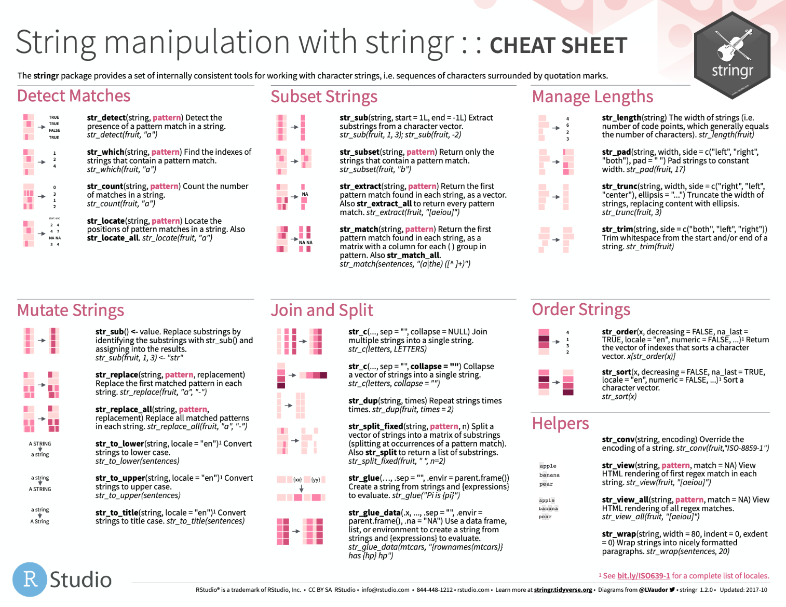

```{r setup, echo = FALSE, message = FALSE, warnings = FALSE}
knitr::opts_chunk$set(comment = NA, 
                      fig.width = 6, 
                      fig.height = 6,
                      fig.align = 'center',
                      echo = FALSE, 
                      eval = TRUE, 
                      warning = FALSE, 
                      message = FALSE)

options(digits = 3)
library(tidyverse)
```

<p align="center" width="100%">
  
  <br>
  <font style="font-size:10px">from: <a href="https://chefsmandala.com/"> Chefsmandala </a></font>
</p>

```{r, echo = FALSE, fig.align = 'center', eval = TRUE, out.width = "70%"}
library(tidyverse)
library(lubridate)
require(scales)

avocado <- read_csv('1_Data/avocado.csv')
#knitr::include_graphics("")
```

# {.tabset}

## Überblick

In diesem finalen Projekt wirst du den gesamten Datascience Kreislauf an Hand von neuen Datensätzen durchspielen. 

Du wirst:

1. **Datenaufbereitung**

- die Daten einlesen
- bereinigen (Spalten Formatierun, Inhalte checken)
- fusionieren (wo nötig, Datensätze zusammenfügen)

2. **Fragestellung erarbeiten**

- Überleg dir eine Frage, die du mit den Daten beantworten kannst. Wie ist der Zusammenhang zwischen X und Y? Was treibt die Variable X? Gibt es eine bevorzugte Art Avocados? Verändert sich eine Variable im Beobachtungszeitraum?
- Fragestellung abgeben (Frage + grobe Skizze wie du die Frage beantworten willst, via email an: <a href="mailto:michael.schulte@unibe.ch">michael.schulte@unibe.ch</a> abgeben (**27.05.21**, 12.00 Uhr (high noon))

3. **Fragestellung beantworten**

- explorieren (diagnostische Plots erstellen)
- grafisch die Antwort(en) aufbreiten
- deskriptiv die Fragen beantworten
- Bonus: satistisch aufbereiten (zB Regression berechnen)

4. **Kommunizieren**

- Kurze R-Markdown Präsentation erstellen, in der die Daten erklärt, die Fage präsentiert und dann die Antwort(en) erläutert werden. 
- Präsentation im Kurs vorstellen (**04.06.21**)
- Code + Markdown Präsentation abgeben (**03.06.21**, high noon)

## Aufgaben

### A - Setup

1. Öffne dein `TheRBootcamp` R Projekt. Es sollte die Ordner `1_Data` und `2_Code` enthalten. Stelle sicher, dass du alle Datensätze, welche im `Datensätze` Tab aufgelisted sind, in deinem `1_Data` Ordner hast. 

2. Öffne ein neues R Skript. Schreibe deinen Namen, das Datum und "Final_Project" als Kommentare an den Anfang des Skripts.

```{r, eval = FALSE, echo = TRUE}
## NAME
## DATUM
## Final Project
```

3. Speichere das neue Skript unter dem Namen `Final_Project.R` im `2_Code` Ordner.

4. Lade die nötigen Pakete (zB: Tidyverse)

### B - Lade die Datensätze

1. Lese die Datensätze (siehe Reiter 'Datensätze') in die Objekte  `prices` und `sales` ein.

```{r, echo = F}
# Lese avocado
prices <- read_csv('1_Data/prices.csv')
sales <- read_csv('1_Data/sales.csv')
```

2. Printe den Datensatz. Wurden alle Variablentypen korrekt identifiziert?

3. Verwende `summary()` um einen weiteren Überblick über die Daten zu bekommen.

4. Füge einen Überblick (Slide Nummer 2 (nach Titelslide)) über die Datensätze am Anfang deiner Präsentation ein!

### C - Datensätze säubern

1. Verwende `names()` um die Spaltennamen anzuzeigen.  

2. Passe die Spaltennamen an die Vorgabe unter 'Datensätze' - Berschreibung  an

3. Sind die Datensätze tidy?

4. Fusioniere die Datensätze in einen Datensatz `avocado`.

### D - Fragestellung erarbeiten

1. Überleg dir eine Frage, die du mit den Daten beantworten kannst. Wie ist der Zusammenhang zwischen X und Y? Was treibt die Variable X? Gibt es eine bevorzugte Art Avocados? Verändert sich eine Variable im Beobachtungszeitraum?

2. Fragestellung kommt auf den Slide Nummer 3.

3. Fragestellung abgeben (Frage + grobe Skizze wie du die Frage beantworten willst, via email an: <a href="mailto:michael.schulte@unibe.ch">michael.schulte@unibe.ch</a> abgeben (**27.05.21**, 12.00 Uhr (high noon))

### E - Fragestellung beantworten

1. Beantworte deine Fragestellung mit all den verschiedenen Ansätzen, die wir im Kurs durchgemacht haben - Tabellen, Grafiken, Statistik (deskriptiv und Inferenz (Bonus)).


### F - Kommunizieren

1.  Öffne ein neues R-Markdown Skript - Presentation - HTML (ioslides). Schreibe deinen Gruppennamen, das Datum und "Final Project" als Information für den Titelslide.

2. Speichere dein R-Markdown Skript in das gleiche Verzeichnis wie dein .RProj File mit Gruppenname_Project.Rmd

3. Erstelle einen Überblicksslide für den `avocado` Datensatz.

4. Erstelle einen Slide mit der Fragestellung

5. Erstelle Slides für die Beantwortung der Fragestellung (Tabellen, deskriptive Statistiken, Grafiken) (max 10!)

## Datensätze

```{r, eval = TRUE, message = FALSE, echo = FALSE}
# sales <- read_csv('1_Data/sales.csv')
# sales_bad <-
# sales %>%
# mutate_if(is.numeric, as.character) %>%
# mutate(SmallMediumAvocado = case_when(is.character(`4046`) ~ paste0('4046_',`4046`))) %>%
# mutate(LargeAvocado = case_when(is.character(`4225`) ~ paste0('4225_',`4225`))) %>%
# mutate(ExtraLargeAvocado = case_when(is.character(`4770`) ~ paste0('4770_',`4770`))) %>%
#   select(-'4046', -'4225', -'4770') %>%
#   select(-`Total Volume`, -`Total Bags`)
# 
# write_csv(sales_bad, '1_Data/sales.csv')
# check <- readr::read_csv(here('1_Data/sales_bad.csv'))

```

Die beiden Datensätze beinhalten Daten über die Verkaufszahlen von Avocados der Firma Hass. In `prices.csv` werden durchschnittliche Preise der Avocados und die Verkaufsregion gelistet, in `sales.csv` die die Grösse der Avocados genauer unterteilt, hier finden sich auch Informationen über die Grösse der Säcke, in denen die Avocados verkauft werden.


|Datei | Zeilen | Spalten | Beschreibung | 
|:----|:-----|:------|:------|
|[prices.csv](https://github.com/michaelschulte/RBootcamp_FS2021/blob/master/1_Data/prices.csv?raw=true)| `r nrow(prices)` | `r ncol(prices)`| Datensatz zu den Avocado-Preisen der Firma Hass in verschiedenen amerikanischen Staaten|
|[sales.csv](https://github.com/michaelschulte/RBootcamp_FS2021/blob/master/1_Data/sales.csv?raw=true)| `r nrow(sales)` | `r ncol(sales)`| Datensatz zu den Avocado Verkaufszahlen der Firma Hass in verschiedenen amerikanischen Staaten |

#### prices.csv

*Erste 5 Zeilen von prices.csv*

```{r, eval = TRUE, echo = FALSE}
knitr::kable(prices[1:5,])
```


|Variable | Beschreibung |
|:--------|:-----------------------------|
|X1 | ID |
|Date | Datum |
|AveragePrice | Durchschnittlicher Preis einer Avocado|
|type | Art der Avocado: "conventional" versus "organic" |
|region | Verkaufsregion |

#### sales.csv

*Erste 5 Zeilen von sales.csv*

```{r, eval = TRUE, echo = FALSE}
knitr::kable(sales[1:5,])
```

|Variable | Beschreibung |
|:--------|:-----------------------------|
|X1 | ID |
|Date | Datum |
|Small Bags | Anzahl verkaufte Säcke: klein |
|Large Bags | Anzahl verkaufte Säcke: gross |
|XLarge Bags | Anzahl verkaufte Säcke: sehr gross |
|type | Art der Avocado: "conventional" versus "organic"|
|region|Verkaufsregion|
|SmallMediumAvocado|Small/Medium Hass Avocado (~3-5oz avocado) Typ #4046| 
|LargeAvocado|Large Hass Avocado (~8-10oz avocado) Typ #4225| 
|ExtraLargeAvocado|Extra Large Hass Avocado (~10-15oz avocado) Typ #4770| 

#### Beispiel der Verkaufszahlen für den Avocado Typ 4225 (ganzer US Markt)


```{r}
avocado %>%
  filter(year(Date) == 2015 & region == 'TotalUS') %>%
  group_by(Date) %>%
  summarise(sum_A = sum(`4225`)) %>%
ggplot(aes(Date, sum_A)) + 
  geom_line(group = 1) +
  scale_y_continuous(labels = comma) +
  labs(y = 'Sales in # pieces',
       title = 'Sales of type 4225 in 2015') +
  theme_bw()
```


## Funktionen

### Pakete

| Package | Installation|
|:------ |:------|
|`lubridate`|`install.packages("lubridate")`|
|`stringr`|`install.packages("stringr")`|
|`tidyverse`|`install.packages("tidyverse")`|

### Funktionen

| Function| Package | Description |
|:---|:------|:-----|
|`arrange()`|`dplyr`|    Fälle sortieren | 
|`case_when()`|`dplyr`| Rekodiere Spalten | 
|`filter()`, `slice()`|`dplyr`|  Fälle auswählen| 
|`join_*()`|`tidyr`|  Tibbles verbinden| 
|`mutate()`|`dplyr`|    Spalten verändern / kreieren |
|`pull()`|`dplyr`|    Eine Spalte herauslösen| 
|`rename()`|`dplyr`|    Spalten umbenennen| 
|`select()`|`dplyr`|    Spalten auswählen | 
|`str_replace()`|`stringr`|    Charakter in einem String ersetzen | 

## Resourcen

### `dplyr` vignette

Siehe die `dplyr` [**vignette**](https://cran.r-project.org/web/packages/dplyr/vignettes/dplyr.html).

### `stringr` vignette

Siehe die `stringr` [**vignette**](https://cran.r-project.org/web/packages/stringr/vignettes/stringr.html).


### Cheatsheet

<p align="center" width="100%">
<a href="image/data-wrangling-cheatsheet.pdf" download>
  </a>
  <br>
  <font style="font-size:10px">from <a href="https://www.rstudio.com/resources/cheatsheets/">R Studio</a></font>
</p>

<p align="center" width="100%">
<a href="image/strings.pdf" download>
  </a>
  <br>
  <font style="font-size:10px">from <a href="https://github.com/rstudio/cheatsheets/blob/master/strings.pdf">R Studio</a></font>
</p>


