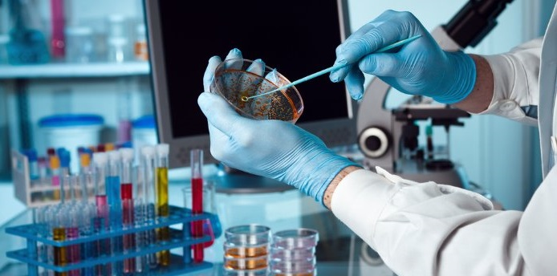

```{r setup, echo = FALSE, warning=F, message=F}
knitr::opts_chunk$set(comment = NA, 
                      fig.width = 6, 
                      fig.height = 6,
                      fig.align = 'center',
                      echo = FALSE, 
                      eval = FALSE, 
                      warning = FALSE,
                      message = FALSE)

options(digits = 3)
```


```{r, eval = TRUE, echo = FALSE, message = FALSE}
library(tidyverse)
# set.seed(100)
# 
# PatientID_v <- sapply(1:300, FUN = function(x) {
#   
#   paste0(sample(letters, size = 8, replace = TRUE), collapse = "")
#   
# })
# 
# 
# arm_v <- rep(c(1, 2, 3), length.out = 300)
# 
# demographics_df <- tibble(
#   PatientID = PatientID_v,
#   age = round(rnorm(n = 300, mean = 40, sd = 5), 0),
#   gender = sample(c(0, 1), size = 300, replace = TRUE),
#   site  = sample(c("London", "Paris", "Tokyo"), size = 300, replace = TRUE),
#   diseasestatus = sample(c("Early", "Mid", "Late"), size = 300, replace = TRUE)
# ) %>%
#   sample_frac(1)
# 
# biomarker_df <- expand.grid(
#   PatientID = PatientID_v,
#   Biomarker = c("dw", "np", "ms"), 
#   stringsAsFactors = FALSE
# ) %>% as_tibble() %>%
#   sample_frac(1)
# 
# biomarker_df$BiomarkerStatus <- sample(c(TRUE, FALSE),
#                                              size = 300, replace = TRUE, prob = c(.25, .75))
# 
# trial_df <-  tibble(
#   PatientID = PatientID_v,
#   arm = arm_v,
#   histamine_start = round(rnorm(n = 300, mean = 50, sd = 15), 2),
#   histamine_end = NA
# ) %>% as_tibble() %>%
#   sample_frac(1) 
# 
# 
# trial_df$histamine_end[trial_df$arm == 1] <- trial_df$histamine_start[trial_df$arm == 1] + round(rnorm(sum(trial_df$arm == 1), mean = 3, sd = 5), 2)
# trial_df$histamine_end[trial_df$arm == 2] <- trial_df$histamine_start[trial_df$arm == 2] + round(rnorm(sum(trial_df$arm == 2), mean = -4, sd = 5), 2)
# trial_df$histamine_end[trial_df$arm == 3] <- trial_df$histamine_start[trial_df$arm == 3] + round(rnorm(sum(trial_df$arm == 3), mean = 0, sd = 5), 2)
# 
# trial_df$qol_start <- round(rnorm(n = 300, mean = 3, sd = 1), 0)
# trial_df$qol_end <- trial_df$qol_start + round(rnorm(n = 300, mean = 0, sd = 1), 0)

# Add some bad  / NA values
# 
# trial_df$histamine_start[sample(nrow(trial_df), size = 5)] <- c(999, -24, 888, -99, 999)
# trial_df$histamine_end[sample(nrow(trial_df), size = 10)] <- NA
# trial_df$histamine_start[sample(nrow(trial_df), size = 7)] <- NA

# write_csv(x = trial_df, path = "_sessions/D2S3_CaseStudies/dimarta_trial.csv")
# write_csv(x = biomarker_df, path = "_sessions/D2S3_CaseStudies/dimarta_biomarker.csv")
# write_csv(x = demographics_df, path = "_sessions/D2S3_CaseStudies/dimarta_demographics.csv")
```


<p align="center">
<br>
<font style="font-size:10px">adapted from [formerfda.com](http://www.formerfda.com/wp-content/uploads/2014/08/clinical-trials.jpg)</font>
</p>


# {.tabset}


## Overview

In this case study, we will look at the results of a clinical trial exploring the effectiveness of a new medication called dimarta on reducing histamine in patients with a disease that leads to chronically high histamine levels. In the study, 300 patients were assigned to one of three different treatment arms. One arm was given a placebo. The other arm was given adiclax -- the standard of care for the disease. Finally, the third arm was given dimarta. There were two main measures of interest in the trial: patient's changes in histamine from the beginning to the end of the trial, and their change in quality of life (measured by self report). 

In addition to exploring the effects of the three medications, the researchers are interested in the extent to which three different biomarkers, dw, ms, and np, are correlated with therapeutic outcomes. In other words, to patients that express one or more of these biomarkers have better, or worse, outcomes that those that do not express these biomarkers?

You should (at least) complete the following tasks

1. load the two .csv files you find in Datasets into R objects.
2. Work through A:D cleaning, visualising and fusioning the two tibbles.
3. Run statistical models (in E) predicting final histamine levels as a function of all variables.
4. Prepare two documents (with code examples) documenting your work - a .html document and a .html presentation (you are expected to use the slides from this presentation to talk us through what you did and what you found out). Check out Task F for more details.
5. **Submit** (regular submission link at the bottom of the start page) a .zip file of your folder with a project file and the .R, Rmd and .html files you generated. I expect that I can run your code and reproduce your results.

**!!Finish all this by 06.11.2020 07.00 am!!**

## Tasks

### A - Getting Setup

1. Open your `TheRBootcamp` R project. It should already have the folders `1_Data` and `2_Code`.

2. Open a new R script. At the top of the script, using comments, write your name and the date. Save it as a new file called `FinalProject_Dimarta.R` in the `TheRBootcamp` folder.  

3. At the top of the script load the `tidyverse` package. 

### B - Data I/O

1. Using `read_csv()`, load the `dimarta_trial.csv`, `dimarta_demographics.csv`, and `dimarta_biomarker.csv` datasets as *three* new objects called `trial_df`, `demographics_df`, and `biomarker_df`.

```{r}
## read in datasets
trial_df <- read_csv("XXX/XXX")
demographics_df <- read_csv("XXX/XXX")
biomarker_df <- read_csv("XXX/XXX")
```


```{r}
## read in datasets
trial_df <- read_csv("1_Data/dimarta_trial.csv")
demographics_df <- read_csv("1_Data/dimarta_demographics.csv")
biomarker_df <- read_csv("1_Data/dimarta_biomarker.csv")
```


2. Get a first impression of the objects you just created by exploring them with a mixture of the `View()`, `head()`, `names()`, and `str()` functions. Were they all loaded correctly?

```{r}
trial_df
demographics_df
biomarker_df
```

### C - Data Wrangling

1. Change the name of the column `arm` in the `trial_df` data to `StudyArm`.

```{r}
trial_df <- XXX %>%
  rename(XXX = XXX)
```

```{r}
trial_df <- trial_df %>%
  rename(StudyArm = arm)
```

2. Using the `table()` function, look at the values of the `StudyArm` column in `trial_df`. You'll notice the values are 1, 2, and 3. Using `mutate()` and `case_when()` change these values to the appropriate names of the study arms (look at the variable descriptions to see which is which!)

```{r}
table(XXX$XXX)

trial_df <- trial_df %>%
  mutate(XXX = case_when(
    XXX == 1 ~ "XXX",
    XXX == 2 ~ "XXX",
    XXX == 3 ~ "XXX"
  ))
```

```{r}
# table(trial_df$StudyArm)

trial_df <- trial_df %>%
  mutate(StudyArm = case_when(
    StudyArm == 1 ~ "placebo",
    StudyArm == 2 ~ "adiclax",
    StudyArm == 3 ~ "dimarta"
  ))
```


3. In the `demographics_df` data, you'll see that gender is coded as 0 and 1. Using `mutate()` create a *new* column in `demographics_df` called `gender_c` that shows gender as a string, where 0 = "male", and 1 = "female".

```{r}
demographics_df <- demographics_df %>%
  mutate(gender_c = case_when(
              XXX == 0 ~ "XXX",
              XXX == 1 ~ "XXX"
            ))
```


```{r}
demographics_df <- demographics_df %>%
  mutate(gender_c = case_when(
    gender == 0 ~ "male",
    gender == 1 ~ "female"
  ))
```

4. Now let's create a new object called `dimarta_df` that combines data from `trial_df` and `demographics_df`. To do this, use `left_join()` to combine the `trial_df` data with the `demographics_df` data. This will merge the two datasets so you can have the study results and demographic data in the same dataframe. Make sure to assign the result to a new object called `dimarta_df`

```{r}
# Create a new dataframe called dimarta_df that contains both trial_df and demographics_df
dimarta_df <- trial_df %>%
  left_join(XXX)
```

```{r}
# Create a new dataframe called dimarta_df that contains both trial_df and demographics_df
dimarta_df <- trial_df %>%
  left_join(demographics_df)
```

5. You'll notice that the `biomarker_df` dataframe is in the 'long' format, where each row is a patient's biomarker result. Making use of the `spread()` function, create a new dataframe called `biomarker_wide_df` where each row is a patient, and the results from different biomarkers are in different columns. When you finish, look at `biomarker_wide_df` to see how it looks!

```{r}
# Convert biomarker_df to a wide format using spread()
biomarker_wide_df <- biomarker_df %>%
  spread(Biomarker, BiomarkerStatus)
```

6. Now, using the `left_join` function, add the `biomarker_wide_df` data  to the `dimarta_df` data! Now you should have all of the data in a single dataframe called `dimarta_df`

```{r}
dimarta_df <- dimarta_df %>% 
  left_join(biomarker_wide_df)
```

7. View `dimarta_df` to make sure the data look correct! The data should have one row for each patient, and 13 separate columns, including  `dw`, `ms`, and `np` 

```{r}
dimarta_df
```

8. Using the `mean()` function, calculate the mean age of all patients.

```{r}
mean(dimarta_df$age)
```

9. Create a table showing how many male and female patients were in the trial.

```{r}
dimarta_df %>%
  group_by(XXX) %>%
  summarise(
    Counts = n()    
  )
```


```{r}
dimarta_df %>%
  group_by(gender_c) %>%
  summarise(
    Counts = n()    
  )
```

10. Now, using similar code, find out how many patients were assigned to each study arm.

```{r}
dimarta_df %>%
  group_by(StudyArm) %>%
  summarise(
    Counts = n()    
  )
```

11. Find out how many men and women were assigned to each study arm (Hint: You can use very similar code to what you used above, just add a second grouping variable!)

```{r}
dimarta_df %>%
  group_by(StudyArm, gender_c) %>%
    mutate(Counts = n())
```

12. Add a new column to the `dimarta_df` data called `histamine_change` that shows the *change* in patient's histamine levels from the start to the end of the trial (Hint: use `mutate()` and just subtract `histamine_start` from `histamine_end`!)

```{r}
dimarta_df <- dimarta_df %>%
  mutate(
    histamine_change = histamine_end - histamine_start
  )
```

13. Add a new column to `dimarta_df` called `qol_change` that shows the change in patient's quality of life.

```{r}
dimarta_df <- dimarta_df %>%
  mutate(
    qol_change = qol_end - qol_start
  )

# Look at result
dimarta_df %>% 
  select(qol_change)
```

14. Calculate the percentage of patients who tested positive for each of the three biomarkers (Hint: If you calculate the `mean()` of a logical vector, you will get the percentage of TRUE values!)

```{r}
# Calculate percent of patients with positive biomarkers

dimarta_df %>%
  summarise(
    dw_mean = mean(XXX),
    ms_percent = mean(XXX),
    np_percent = mean(XXX)
  )
```


```{r}
# Calculate percent of patients with positive biomarkers

dimarta_df %>%
  summarise(
    dw_mean = mean(dw),
    ms_percent = mean(ms),
    np_percent = mean(np)
  )
```

15. Were there different distributions of age in the different trial sites? To answer this, separately calculate the mean and standard deviations of patient ages in each site. (Hint: group the data by `site`, then calculate two separate summary statistics: `age_mean = mean(age)`, and `age_sd = sd(age)`.

```{r}
# Calculate the mean change in histamine for each study site
dimarta_df %>%
  group_by(site) %>%
  summarise(
    age_mean = mean(age),
    age_sd = sd(age)
  )
```

16. Calculate the mean change in histamine results separately for each study site 

```{r}
# Calculate the mean change in histamine for each study site
dimarta_df %>%
  group_by(site) %>%
  summarise(
    histamine_change_mean = mean(histamine_change, na.rm = TRUE)
  )
```


17. Calculate the mean change in histamine results (`histamine_change`) for each study arm. Which study arm had a largest decrease in histamine?

```{r}
# Calculate the mean change in histamine for each study site
dimarta_df %>%
  group_by(StudyArm) %>%
  summarise(
    histamine_change_mean = mean(histamine_change, na.rm = TRUE)
  )
```

18. Calculate the mean change in quality of life (`qol_change`) for each study arm. Do the results match what you found with the histamine results?

```{r}
# Calculate the mean change in histamine for each study site
dimarta_df %>%
  group_by(StudyArm) %>%
  summarise(
    qol_change_mean = mean(qol_change, na.rm = TRUE)
  )
```

### D - Plotting

1. Create boxplots showing the relationship between study arm and histamine change.

```{r}
ggplot(data = XXX,
       mapping = aes(x = XXX, 
                     y = XXX)) +
  geom_boxplot() +
  labs(title = "XX",
       subtitle = "XX",
       caption = "XX")
```

```{r}
ggplot(data = dimarta_df,
       mapping = aes(x = StudyArm, 
                     y = histamine_change)) +
  geom_boxplot() +
  labs(title = "Histamine change",
       subtitle = "Dimarta",
       caption = "I love R!")
```

2. Try using `geom_jitter()` to add the raw points to the plot

```{r}
ggplot(data = dimarta_df,
       mapping = aes(x = StudyArm, 
                     y = histamine_change)) +
  geom_boxplot() + 
  geom_jitter(width = .1) +
  labs(title = "Histamine change",
       subtitle = "Dimarta",
       caption = "I love R!")
```

3. Create the same plot as above, but instead of analysing study arm, try analysing gender. (Tip! convert gender to a factor with `factor(gender)`) What do you find? Did one gender have better histamine improvements than the other?

```{r}
ggplot(data = dimarta_df,
       mapping = aes(x = factor(gender), 
                     y = histamine_change)) +
  geom_boxplot() +
  geom_jitter(width = .1) +
  labs(title = "Histamine change",
       subtitle = "Dimarta",
       caption = "I love R!",
       x = "Gender")
```


4. Now create the same plot but show both gender and study arm in the same plot. One way to do this would be to color the points by gender!

```{r}
ggplot(data = dimarta_df,
       mapping = aes(x = StudyArm, 
                     y = histamine_change,
                     col = factor(gender))) +
  geom_boxplot() +
  geom_jitter(width = .1) +
  labs(title = "Histamine change",
       subtitle = "Dimarta",
       caption = "I love R!",
       x = "Gender")
```

5. Is there a correlation between patient's starting and ending histamiine levels? Create a scatterplot with a regression line to find out!

```{r}
ggplot(data = XXX,
       aes(x = XXX, y = XXX)) +
  geom_XXX() + 
  geom_XXX() +
  labs(title = "XXX",
       caption = "XXX")
```

```{r}
ggplot(data = dimarta_df,
       aes(x = histamine_start, 
           y = histamine_end)) +
  geom_point() + 
  geom_smooth() +
  labs(title = "Histamine start and end correlation",
       caption = "Dimarta")
```

6. Now create the same plot as above, but have different colored points for different study arms (but only one regression line).

```{r}
ggplot(data = dimarta_df,
       aes(x = histamine_start, 
           y = histamine_end,
           col = StudyArm)) +
  geom_point() + 
  geom_smooth(col = "black") +
  labs(title = "Histamine start and end correlation",
       caption = "Dimarta")
```

7. Instead of having different study arms as different colored points, create another plot using `facet_wrap()` to have different study arms in different plotting panels.

```{r}
ggplot(data = dimarta_df,
       aes(x = histamine_start, 
           y = histamine_end)) +
  geom_point() + 
  geom_smooth(col = "black") +
  facet_wrap(~ StudyArm) +
  labs(title = "Histamine start and end correlation",
       caption = "Dimarta")
```

### E - Statistics

1. Create a regression model predicting final histamine levels as a function of all variables in the dataset that make clinical sense to include (as far as you can judge this). Call it `full_glm`.

```{r}
full_glm <- glm(formula = histamine_end ~ age + StudyArm + gender + site + histamine_start,
                data = dimarta_df)
```


2. Explore the object with `summary()`, `tidy()` (part of the `broom` package), and `names()`. Which variables predict final histamine levels? 
```{r}
summary(full_glm)

library(broom)

tidy(full_glm)

names(full_glm)
```

3. Add the residuals from this model as a new column in your data called `residuals_full`

```{r}
dimarta_df <- dimarta_df %>%
  mutate(residuals_full = full_glm$residuals)
```

4. Plot the residuals from the regression as a histogram (hint: you can find the residuals in your regression object). How do they look?

```{r}
ggplot(dimarta_df,
       aes(x = residuals_full)) +
  geom_histogram()
```

5. Add the absolute value of the residuals from the model as a new column in your data called `residuals_abs_full` 

```{r}
dimarta_df <- dimarta_df %>%
  mutate(residuals_abs_full = abs(residuals_full))
```

6. Plot the absolute value of the residuals as a histogram. How do these look?

```{r}
ggplot(dimarta_df,
       aes(x = residuals_abs_full)) +
  geom_histogram()
```


7. What is the mean value of the absolute value of this residuals?

```{r}
dimarta_df %>%
  summarise(residuals_abs_full_mean = mean(residuals_abs_full))
```

8. Now create a regression model predicting histamine change based *only* on the study arm. Call it `arm_glm`. Then follow the steps above to add the residuals (original and absolute) from this model to your dataframe. Call them `residuals_arm` and `residuals_abs_arm`.

```{r}
arm_glm <- glm(formula = histamine_end ~ StudyArm,
               data = dimarta_df)
```

9. Calculate the mean of the raw and absolute residuals from your `arm_glm` model. How do they compare to your `full_glm` model? What does this mean?

```{r}
mean(arm_glm$residuals)

mean(abs(arm_glm$residuals))

```

### F - Presenting the results

1. Generate a new file with `File - R Markdown - Document` (with the default: HTML). Save this file to your `TheRBootcamp` folder. 

2. Document your 3 central insights out of this dataset. Describe what the insights are with your own words and document them with figures, statistics and tables produced with R code in your Marddown file `FinalReport_GROUPNAME.html`.   

3. Generate a new file with `File - R Markdown - Presentation` (with the default: HTML Isoslides). Save this file to your `TheRBootcamp` folder `FinalPresentation_GROUPNAME.html`. 

4. Prepare a **3 minute presentation** documenting your approach to the Document your 3 central insights out of this dataset. Describe what the insights are with your own words and document them with figures, statistics and tables produced with R code in your Markdown file.


## Datasets

|File | Rows | Columns | Description |
|:----|:-----|:------|:-----------------------------------------|
|[dimarta_trial.csv](https://raw.githubusercontent.com/therbootcamp/BaselRBootcamp_2018July/master/_sessions/_data/baselrbootcamp_data/dimarta_trial.csv) | 300 | 6 | Key DIMARTA trial outcomes|
|[dimarta_biomarker.csv](https://raw.githubusercontent.com/therbootcamp/BaselRBootcamp_2018July/master/_sessions/_data/baselrbootcamp_data/dimarta_biomarker.csv) | 900 | 3 | Biomarker status' for 3 different biomarkers for each patient. |
|[dimarta_demographics.csv](https://raw.githubusercontent.com/therbootcamp/BaselRBootcamp_2018July/master/_sessions/_data/baselrbootcamp_data/dimarta_demographics.csv) | 300 | 5 | Demographic information for each patient |

Column Descriptions

**dimarta_trial.csv**

| Variable| Description|
|:------------------------------|:----------------------------------------------------------------|
|     PatientID|    Unique patient id|
|     arm|  Treatment arm, either 1 = placebo, 2 = adiclax (the standard of treatment), or 3 = dimarta (the target drug)| 
|     histamine_start| histamine value at the start of the trial|
|     histamine_end| histamine value at the end of the trial|
|     qol_start| Patient's rated quality of life at the start of the trial|
|     qol_end| Patient's rated quality of life at the end of the trial|

Table: Table1. `dimarta_trial.csv` variable description:

**dimarta_demographics.csv**

| Variable| Description|
|:------------------------------|:----------------------------------------------------------------|
|     PatientID|    Unique patient id|
|     age|   Patient age| 
|     gender| Patient gender, 0 = male, 1 = female|
|     site| Site where the clinical trial was conducted|
|     diseasestatus| Status of the patient's disease at start of trial|

Table: Table2. `dimarta_demographics.csv` variable description:

**dimarta_biomarker.csv**

| Variable| Description|
|:------------------------------|:----------------------------------------------------------------|
|     PatientID|    Unique patient id|
|     Biomarker|    One of three biomarkers: dw, ms, and np| 
|     BiomarkerStatus| Result of the test for the biomarker.|

Table: Table3. `dimarta_biomarker.csv` variable description:
