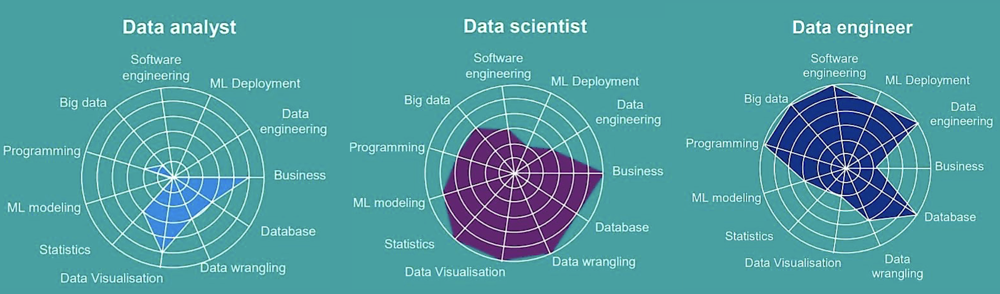
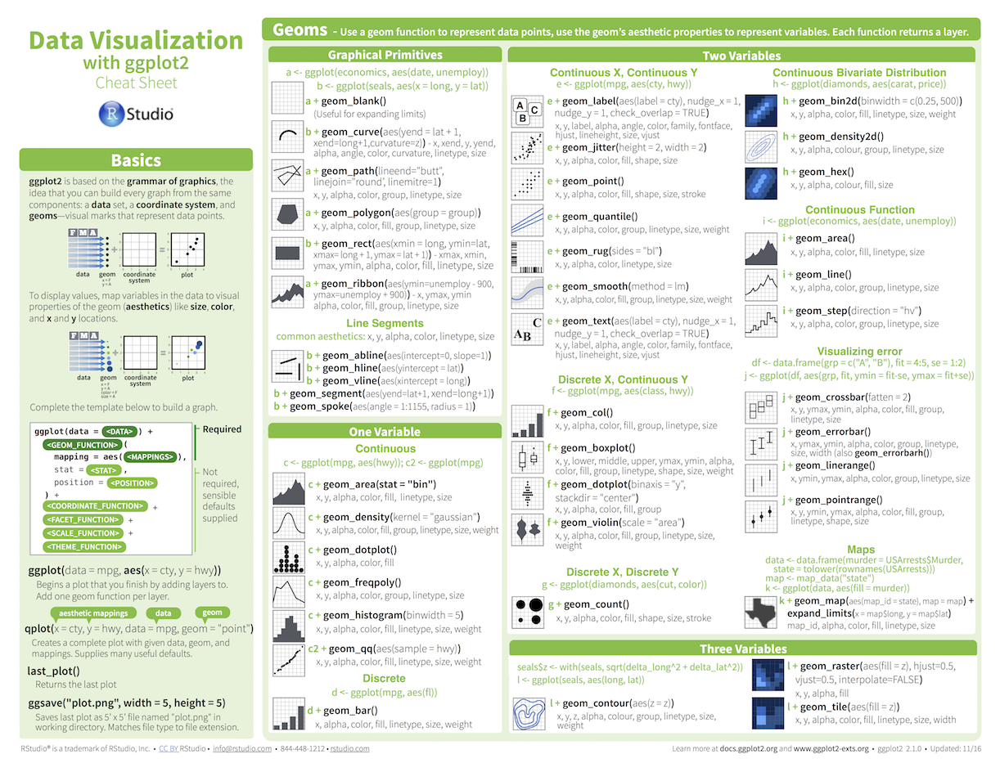

layout: true

<div class="my-footer">
  <span style="text-align:center">
    <span> 
      
    </span>
    <a href="https://therbootcamp.github.io/">
      <span style="padding-left:82px"> 
        <font color="#7E7E7E">
          www.therbootcamp.com
        </font>
      </span>
    </a>
    <a href="https://therbootcamp.github.io/">
      <font color="#7E7E7E">
       Datascience mit R lernen | HS 2020
      </font>
    </a>
    </span>
  </div> 

---


```{r setup, include=FALSE}
options(htmltools.dir.version = FALSE)
options(width = 110)
options(digits = 4)

knitr::opts_chunk$set(fig.align = 'center')
```


.pull-left45[
<br><br><br><br><br>
#  Agenda und Materialien

Klicke auf <high>"Start Bootcamp"</high> auf Ilias!

]

.pull-right5[

<br><br>
<iframe src="https://michaelschulte.github.io/RBootcamp_HS2020/" width="500" height="500"></iframe>

]

---

.pull-left6[

<br><br><br><br><br>

# Ziel

>###Das Ziel dieses Kurses ist Euch den kompetenten Umgang mit R für die Aufbereitung, Exploration, und Visualisierung von Daten zu vermitteln. 

]

.pull-right4[

<br><br><br><br>
<p align="center"></p>

]


---

.pull-left3[

# Der Data Science Kreislauf

]

.pull-right7[
<br>
<p align = "center">
<br>
<font style="font-size:10px">from <a href="http://sudeep.co/">http://sudeep.co/</a></font>
</p>
]

---

# Data Science Rollen

<br><br>
<p align = "center">
<br>
<font style="font-size:10px">from <a href="https://news.efinancialcareers.com/sg-en/3001517/data-science-careers-finance">efinancialcareers.com</a></font>
</p>

---

# Data Science’s missverstandener Held

.pull-left45[

<i>"Each of the three data science disciplines has its own excellence. Statisticians bring rigor, ML engineers bring performance, and analysts bring speed."</i>

<i>"Your analyst is the sprinter; their ability to quickly help you see and summarize what-is-here is a superpower for your process."</i>

<i>"The only roles every business needs are decision-makers and analysts. If you lose your analysts, who will help you figure out which problems are worth solving?"</i>

<a href="https://hbr.org/2018/12/what-great-data-analysts-do-and-why-every-organization-needs-them">Harvard Business Review</a><br><a href="https://towardsdatascience.com/secret-paragraphs-from-hbrs-analytics-ddd2ead761d4">Towards Data Science</a>

<br>
<b>Cassie Kozyrkov</b><br>
Chief Decision Scientist at Google

]


.pull-right45[

<p align = "center">
<br>
<font style="font-size:10px">from <a href="https://medium.com/@kozyrkov"</a></font>
</p>

]

---

.pull-left4[

<br>
# Ablauf 

<ul>
  <li class="m1"><span><high>Wiederholung</high></span></li>
  <ul class="level">
    <li><span>Gruppen gestalten Wiederholung</span></li>
    <li><span>Offene Fragen klären</span></li>
  </ul>
  <li class="m2"><span><high>Thematischer Input</high>
  <ul class="level">
    <li><span>Folien-basierten Einführung</span></li>
    <li><span>Code-Beispiele</span></li>
    <li><span>Live Demos</span></li>
  </ul>
  </span></li>
  <li class="m3"><span><high>Praktischer Teil</high>
  <ul class="level">
    <li><span>Programmieren in Teams</span></li>
    <li><span>Ende: Projektpräsentation</span></li>
  </ul>
  </span></li>
</ul>

]

.pull-right45[
<br><br>


]

---


# Einführung

.pull-left45[
<br2>

<ul>
  <li class="m1"><span><high>Einführung</high>
  <br><br>
  <ul class="level">
    <li><span>30-45 min</span></li>
    <li><span>Konzepte & Code Beispiele</span></li>
  </ul>
  </span></li>
  <li class="m2"><span><high>Materialien</high>
  <br><br>
  <ul class="level">
    <li><span><a href="https://michaelschulte.github.io/RBootcamp_HS2020/">online verfügbar</a></span></li>
  </ul>
  </span></li>
</ul>

]

.pull-right55[

<p align="center">

<br>
<font style="font-size:10px">from <a href="www.Freepik.com">Freepik.com</a></font>
</p>

]


---

.pull-left45[

# Übungen


<ul>
  <li class="m1"><span><high>Selber Programmieren</high>
  <br><br>
  <ul class="level">
    <li><span>20 - 50 Aufgaben</span></li>
    <li><span>Zu Beginn einfach dann zunehmend schwieriger.</span></li>
    <li><span>Folgt Eurem eigenen Tempo.</span></li>
    <li><span>Antworten kommen später.</span></li>
  </ul>
  </span></li>
</ul>

]


.pull-right5[
<br>

  <iframe src="https://michaelschulte.github.io/RBootcamp_HS2020/_sessions/Data/Data_practical.html" height="480px" width = "500px"></iframe>

  Beispiel:<a href="https://michaelschulte.github.io/RBootcamp_HS2020/_sessions/Data/Data_practical.html"> Daten </a>

]

---

# Cheatsheets

<table width="100%" style="cellspacing:0; cellpadding:0; border:none">
  <tr>    
  <td>
  <p align = 'center'>RStudio<br><br>
  <a href="image/rstudio-ide.pdf"></a></p>
  </td>
 
  <td>
   <p align = 'center'>Base R<br><br>
  <a href="image/base-r.pdf"></a></p>
  </td>  
  
  <td> 
   <p align = 'center'>Daten Import<br><br>
  <a href="image/data-import.pdf" download></a></p>
  </td>
  
  <td>
  <p align = 'center'>Daten Wrangling<br><br>
  <a href="image/data-transformation.pdf"></a></p>
  </td>

  <td>
  <p align = 'center'>Daten Visualisierung<br><br>
  <a href="image/data-visualization-2.1.pdf"></a></p>
  </td>
  

  </tr>
</table>
<br>

---

.pull-left4[

<br><br>
# Pausen

<ul>
  <li class="m1"><span>Mach <high>jederzeit</high> Pausen.</span></li>
  <li class="m2"><span>Programmieren braucht [Kaffee|Tee|Wasser].</span></li>
  <li class="m3"><span>Mich gerne daran <high>erinnern</high>, dass eine Pause gut wäre!</span></li>
  <li class="m4"><span>Eine fixe 30-Minuten Pause in der Mitte des Nachmittages</li>
  
</ul>

]


.pull-right6[

<p align='center'><br><br><br><br>
<br>
<font style="font-size:10px">from <a href="https://wikipedia.org">wikipedia.org</a></font>
</p>

]


---

# Photos

<p align="center">

</p>

---

# Vorstellung

.pull-left5[

<ul>
  <li class="m1"><span>Wie heisst Du?</span></li>
  <li class="m2"><span>Was ist dein Hauptfach?</span></li>
  <li class="m3"><span>Hast du Programmiererfahrung mit R oder anderen Programmiersprachen?</span></li>
  <li class="m4"><span>Wieso möchtest Du R lernen?</span></li>
  <li class="m5"><span>Kaffee oder Tee?</span></li>
  <li class="m6"><span>Bier oder Wein?</span></li>
  <li class="m7"><span>Berlin oder Paris?</span></li>
</ul>

]

.pull-right45[

<p align="center">

<br>
<font style="font-size:10px">from <a href="www.artofmanliness.com">artofmanliness.com</a></font>
</p>

]

---

# Teams bilden

.pull-left5[

<ul>
  <li class="m1"><span>Random allocation?</span></li>
  <li class="m2"><span>Präferenzen für Teams?</span></li>
  <li class="m3"><span>Gruppename finden</span></li>
</ul>


<a href="https://docs.google.com/spreadsheets/d/17o_D2txO8h9igLfw1COqRKZsTIzOdTRdANO_gROf6vM/edit?usp=sharing">Liste für die Gruppenamen</a>

]

.pull-right45[

<p align="center">

<br>
<font style="font-size:10px">from <a href="www.freepik.com">www.freepik.com</a></font>
</p>

]

---

class: middle, center

<h1><a href=https://michaelschulte.github.io/RBootcamp_HS2020/index.html>Agenda</a></h1>
