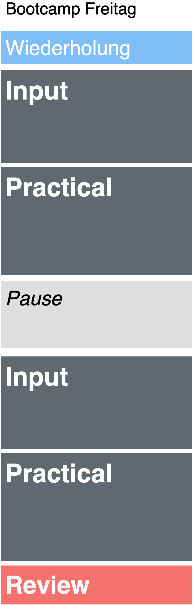

# Der Plan: 

|Datum|Thema|Einführung|Übungen|
|:--:|:-|:--:|:--:|
|18.09.| Willkommen! | [slides](_sessions/Welcome/Welcome.html) | | 
|      | Einführung R | [slides](_sessions/IntroToR/IntroToR.html), [data sets](https://michaelschulte.github.io/RBootcamp_HS2020/1_Data/TheRBootcamp_HS2020_data.zip) | [source](_sessions/IntroToR/IntroToR_interactive.R) |
|      | Data | [slides](_sessions/Data/Data.html) | [practical](_sessions/Data/Data_practical.html), [solutions](_sessions/Data/Data_practical_solutions.html)|
|25.09.| Recap | | | 
|| Wrangling I | [slides](_sessions/Wrangling/Wrangling.html) |  [practical](_sessions/Wrangling/Wrangling_practical.html)   [Practical Upload](https://www.dropbox.com/request/G8GcXUsYXDdvNq2QlRf5) Format: NAME_Wrangling1.R, [solutions](_sessions/Wrangling/Wrangling_practical_solutions.html)| 
|      | Wrangling II | [slides](_sessions/WranglingII/WranglingII.html) | [practical](_sessions/WranglingII/WranglingII_practical.html)    [Practical Upload](https://www.dropbox.com/request/G8GcXUsYXDdvNq2QlRf5) Format: NAME_Wrangling2.R, [solutions](_sessions/WranglingII/WranglingII_practical_solutions.html)|
|09.10.| Recap | | | 
|| Plotting I | [slides](_sessions/PlottingI/PlottingI.html) | [practical](_sessions/PlottingI/PlottingI_practicaI.html), [solutions](_sessions/PlottingI/PlottingI_practicaI_solutions.html)| 
|| Plotting II | [slides](_sessions/PlottingII/PlottingII.html) | [practical](_sessions/PlottingII/PlottingII_practical.html), [solutions](_sessions/PlottingII/PlottingII_practical_solutions.html)|
|16.10.| Recap | | | 
|| Plotting III + Competition | [slides](_sessions/PlottingIII/PlottingIII.html)| [Competition](_sessions/PlottingIII/Competition.html)| |
|| Intro Projekte||[Covid-Boot-Camp & Arr-PiRaten](_sessions/Project/FinalProject_Medicine.html)   [We-R-lost & R-Pandemi](_sessions/Project/FinalProject_Clinical.html)||
|23.10.| Recap | | | 
|| Lineare Modelle |[slides](_sessions/LinearModelsI/LinearModelsI.html)| [practical](_sessions/LinearModelsI/LinearModelsI_practical.html), [solutions](_sessions/LinearModelsI/LinearModelsI_practical_solutions.html)| |
|| Reporting | [slides](_sessions/Reporting/Reporting.html)| [practical](_sessions/Reporting/Reporting_practical.html), [solutions](_sessions/Reporting/Reporting_practical_solutions.html)||
|06.11.| Projektpräsentationen | | [feedback](https://forms.gle/38LagXxyH2cMHynt8)| 
|| Covid-R-Bootcamp, We-R-Lost, Arr-PiRaten, R-Pandemi |  | <!--- [Medicine](_sessions/FinalProject/FinalProject_Medicine.html), [Clinical](_sessions/FinalProject/FinalProject_Clinical.html)--->| |

# Practicals

Upload bitte in der Form: Gruppe_Practical#.R

[Practical Upload](https://www.dropbox.com/request/G8GcXUsYXDdvNq2QlRf5)

<!---

|  | Day 1 Fundamentals| Day 2 Analysis| Day 3 Reporting| 
|:--|:-------------|:-------------|:-------------|
|0| Welcome! [Folien](_sessions/Welcome/Welcome.html) | Recap I [Folien](_sessions/Recap/Recap.html)| Recap II [Folien](_sessions/RecapII/RecapII.html)|
|1| Intro to R [Folien](_sessions/IntroToR/IntroToR.html), [source](_sessions/IntroToR/IntroToR_interactive.R) | Statistics I  [Folien](_sessions/StatisticsI/StatisticsI.html), [Practical](_sessions/StatisticsI/StatisticsI_Practical.html) | Plotting II  [Folien](_sessions/PlottingII/PlottingII.html), [Practical](_sessions/PlottingII/PlottingII.html) |
|2|  Data  [Folien](_sessions/Data/Data.html), [Practical](_sessions/Data/Data_Practical.html)| Statistics II [Folien](_sessions/StatisticsII/Statistics.html), [Practical](_sessions/StatisticsII/Statistics_Practical.html)| Reporting [Folien](_sessions/Reporting/Reporting.html), [Practical](_sessions/Reporting/Reporting_Practical.html)|
|3|   Wrangling [Folien](_sessions/Wrangling/Wrangling.html), [Practical](_sessions/Wrangling/Wrangling_Practical.html) | Plotting I [Folien](_sessions/PlottingI/Plotting.html), [Practical](_sessions/PlottingI/Plotting_Practical.html) |Case Studies [Intro](_sessions/CaseStudies/CaseStudies.html) [1: Clinical Trial](_sessions/CaseStudies/Clinical_Data_Case_Study.html) [2: Finance ](_sessions/CaseStudies/Financial_Data_Case_Study.html)|
|4| |  | Next Steps  [Folien](_sessions/NextSteps/NextSteps.html) |
 

### Agenda

 
    

--->
